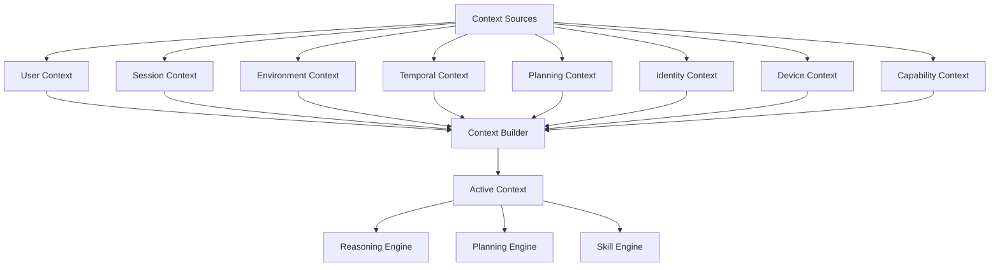
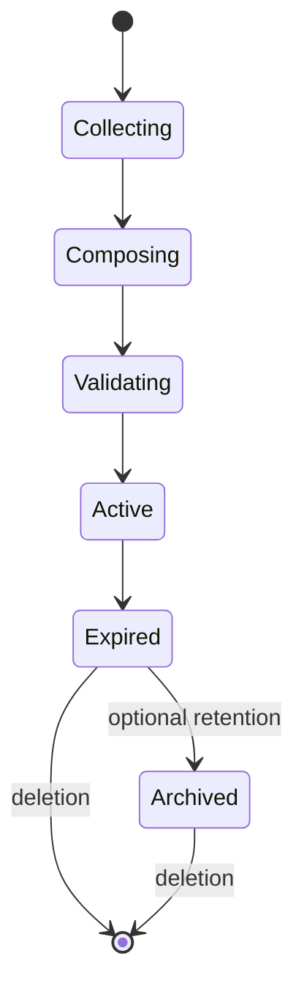
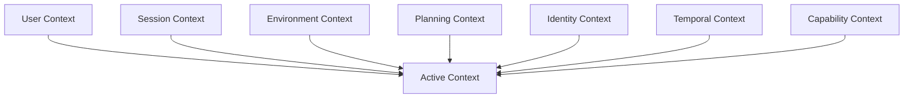
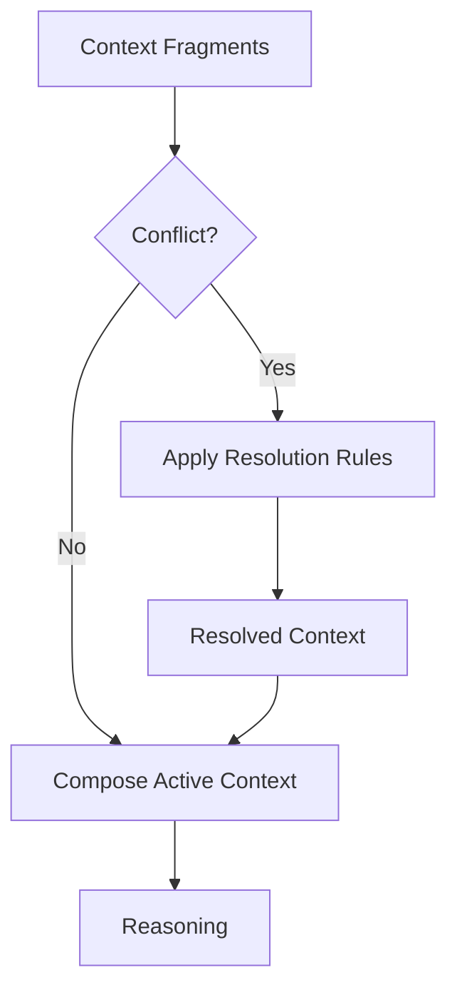
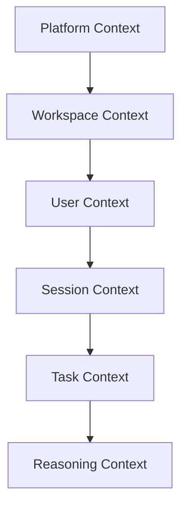

# CONCEPT-0003 — Context Model

| Field | Value |
|--------|--------|
| **Status** | Active |
| **Version** | 3.1.0 |
| **Owner** | O.R.I.O.N. Architecture |
| **Created** | 2026-07-11 |
| **Updated** | 2026-07-19 |
| **Applies To** | Entire Platform |

---

# Abstract

The Context Model defines how O.R.I.O.N. represents, composes, evolves, and expires the information that is relevant at a specific moment in time.

Unlike Memory, which preserves intentionally retained experience and user continuity, or Knowledge, which represents justified claims accepted as sufficiently true, Context is intentionally ephemeral. It exists solely to select or project information relevant to the current situation and evolves as the environment, user interactions, and system state evolve.

This specification establishes the conceptual foundations of Context within the O.R.I.O.N. architecture, defining its principles, lifecycle, composition rules, identity, metadata, relationships with other cognitive models, and its role in enabling explainable, deterministic, and capability-oriented reasoning.

The goal of this document is to provide a technology-independent specification that guides every future implementation of the Context Engine while maintaining architectural consistency across providers, devices, execution environments, and AI models.

## Table of Contents

1. Purpose
2. Vision
3. Scope
4. Definitions
    4.1 Terminology Conventions
    4.2 Architectural Terms
    4.3 Specification Language
5. Design Goals
6. Non-Goals
7. Core Principles
8. Conceptual Model
9. Core Components
10. Context Lifecycle
11. Context Lineage and Revision Identity
12. Context Metadata
13. Context Composition
14. Context Resolution
15. Context Hierarchy and Scopes
16. State Management
17. Relationships
18. Engine Responsibilities
19. Design Constraints
20. Examples
21. Future Evolution
22. References

Document Classification

Normative Sections
Informative Sections
RFC Keywords
Reading Guide

# 1. Purpose

The purpose of the Context Model is to establish a unified conceptual framework for representing the information that is relevant to reasoning at a specific moment in time.

Within O.R.I.O.N., every intelligent decision depends on the ability to understand not only what is accepted as true (Knowledge) or what has been intentionally retained as experience (Memory), but also what is relevant across the user, the environment, the platform, and the execution state right now.

The Context Model provides this capability by defining a temporary, composable, and continuously evolving representation of the operational state of the system.

This specification is technology-independent and serves as the architectural contract for every future implementation of the Context Engine.

Its objectives are to:

- Establish a common language for Context across the platform.
- Define the lifecycle of contextual information.
- Specify how Context is composed from multiple sources.
- Describe the relationship between Context, Memory, and Knowledge.
- Provide deterministic rules for context resolution.
- Enable explainable reasoning across engines and skills.
- Preserve architectural consistency independently of providers or execution environments.

This document intentionally focuses on conceptual behavior rather than implementation details.

Implementation-specific concerns are delegated to the corresponding Engine Specifications.

# 2. Vision

O.R.I.O.N. is designed as a long-lived intelligent operating network capable of interacting with users, services, devices, and autonomous capabilities across heterogeneous environments.

To operate effectively, the platform must continuously answer a fundamental question:

> **"What is happening right now?"**

The Context Model exists to provide this answer.

Rather than representing accepted Knowledge or intentionally retained experiences, Context captures the transient conditions under which reasoning occurs. It represents the current operational reality of the platform, selecting or projecting relevant information from the user, the environment, active workflows, system state, Memory, and Knowledge into a unified cognitive representation.

This model enables every Engine, Skill, and planning component to reason from a shared understanding of the present moment.

As O.R.I.O.N. evolves toward multi-agent collaboration, distributed execution, and cross-device intelligence, Context becomes the common language that synchronizes decision making while preserving consistency, explainability, and deterministic behavior.

The long-term vision of the Context Model is to establish a technology-independent abstraction capable of representing the operational state of the platform regardless of implementation details, execution environments, providers, or artificial intelligence models.

By separating temporary contextual information from intentionally retained Memory and accepted Knowledge, O.R.I.O.N. ensures that reasoning remains adaptive without compromising architectural integrity or long-term maintainability.

# 3. Scope

This specification defines the conceptual foundations of Context within the O.R.I.O.N. platform.

It establishes the principles, terminology, responsibilities, and behavioral rules that govern how contextual information is represented, composed, maintained, and consumed during system operation.

Specifically, this document defines:

- The conceptual definition of Context.
- The role of Context within the cognitive architecture.
- The lifecycle of contextual information.
- Context composition and resolution principles.
- Relationships between Context, Memory, and Knowledge.
- Context identity and metadata.
- Architectural constraints governing Context evolution.
- Responsibilities delegated to the Context Engine.

This specification intentionally avoids implementation-specific details, including storage mechanisms, serialization formats, synchronization protocols, provider integrations, or execution strategies.

Such concerns belong to implementation-level specifications and Engine documentation.

# 4. Definitions

The following definitions establish the terminology used throughout this specification.

| Term | Definition |
|------|------------|
| **Context** | The temporary selection or projection of information relevant to the current operational or reasoning situation. |
| **Context Fragment** | An independent unit of contextual information that contributes to the construction of a Context Revision. |
| **Active Context** | A Context Revision whose lifecycle state is Active and which is valid for consumption. |
| **Context Source** | A Context-facing role that contributes information through a domain-owned Contract while preserving the authoritative owner and source-revision semantics. |
| **Context Resolution** | The process of resolving conflicting or overlapping contextual information from multiple sources. |
| **Context Lifetime** | The period during which a Context remains valid for reasoning purposes. |
| **Context Lineage** | The logical evolution of related Context Revisions. |
| **Context Lineage Identity** | The stable identity shared by every Context Revision in one Context Lineage. |
| **Context Revision** | One immutable representation of Context within a Context Lineage. |
| **Context Revision Identity** | The unique identity assigned to one Context Revision. |
| **Context Snapshot** | An immutable materialized representation of one Context Revision. |
| **Logical Reconstruction** | Construction of a logically equivalent Context Revision from authoritative, version-identifiable source revisions. |
| **Exact Replay** | Exact reproduction of the Context Revision consumed by a reasoning cycle from sufficient immutable historical evidence. |
| **Reasoning Cycle** | A complete execution cycle during which exactly one immutable Active Context Revision is consumed by the Reasoning Engine. |

# 5. Terminology Conventions

The following conventions are used throughout this specification to ensure consistency, readability, and unambiguous interpretation.

These conventions apply to all current and future O.R.I.O.N. specifications unless explicitly overridden.

| Convention | Meaning | Example |
|------------|---------|---------|
| **PascalCase** | Architectural concepts, engines, and major platform components. | `Context`, `Memory`, `Knowledge`, `Reasoning Engine` |
| *italic* | First introduction of a new conceptual term. | *Context Fragment* |
| `code` | Technical identifiers, interfaces, properties, contracts, or implementation examples. | `lineageId`, `revisionId`, `ContextBuilder` |
| **UPPERCASE** | Reserved keywords, logical states, or platform constants. | `ACTIVE`, `EXPIRED`, `INVALID` |

---

## Concept Naming

Within O.R.I.O.N., conceptual entities are treated as architectural abstractions rather than implementation artifacts.

Consequently, capitalized terms always refer to architectural concepts.

Examples include:

- **Context**
- **Memory**
- **Knowledge**
- **Reasoning**
- **Capability**
- **Skill**
- **Engine**
- **Provider**
- **Adapter**

Lowercase forms refer to concrete instances of those concepts.

Examples:

- a context
- a memory record
- a knowledge source
- an engine instance

---

## Context Terminology

Unless otherwise specified, the following terminology is used consistently throughout the platform.

| Term | Description |
|------|-------------|
| **Context** | The architectural concept representing temporary operational information. |
| **context** | A concrete instance of Context. |
| **Active Context** | A Context Revision in the Active lifecycle state and valid for consumption. It is not a separate identity model. |
| **Context Fragment** | An independently produced portion of contextual information. |
| **Context Builder** | The component responsible for assembling Context Fragments into a Context Revision. |
| **Context Source** | A Context-facing role that contributes information through a domain-owned Contract while preserving the authoritative owner and source-revision semantics. |
| **Context Lineage** | The logical evolution shared by related Context Revisions. |
| **Context Lineage Identity** | The stable identity of one Context Lineage. |
| **Context Revision** | One immutable representation of Context within a lineage. |
| **Context Revision Identity** | The unique identity of one Context Revision. |
| **Context Snapshot** | An immutable materialized representation associated with one Context Revision Identity. |

---

## Engine Terminology

All architectural engines follow a consistent naming convention.

Examples include:

- Context Engine
- Memory Engine
- Knowledge Engine
- Planning Engine
- Identity Engine
- Skill Engine
- Voice Engine

The term **Engine** always refers to a capability owner within the platform architecture and never to a specific software process or executable.

---

## Specification Language

The keywords **MUST**, **MUST NOT**, **SHOULD**, **SHOULD NOT**, and **MAY** are to be interpreted as described in RFC 2119.

These keywords indicate the normative strength of architectural requirements within this specification.

Examples:

- A Context **MUST** have a unique identity.
- Context **MUST NOT** duplicate Knowledge.
- A Context Fragment **MAY** originate from an external Provider.
- A Context Builder **SHOULD** preserve deterministic composition whenever possible.

---

> **NOTE**
>
> Consistent terminology is considered part of the architectural contract.
> Future specifications SHOULD reuse these definitions whenever applicable instead of redefining equivalent concepts.

# 5. Design Goals

The Context Model is designed to provide a consistent, deterministic, and technology-independent representation of the information required for reasoning at any given moment.

The following goals guide every architectural and implementation decision related to Context within the O.R.I.O.N. platform.

## 5.1 DG-001 — Represent the Present

Context MUST represent the current operational reality of the platform rather than historical or permanent information.

Its primary purpose is to answer the question:

> **"What is relevant right now?"**

---

## 5.2 DG-002 — Enable Deterministic Reasoning

Given the same inputs, Context SHOULD produce the same logical representation.

Deterministic Context construction improves explainability, reproducibility, debugging, and testing across the platform.

---

## 5.3 DG-003 — Support Composability

Context MUST be composed from independent Context Fragments rather than constructed as a monolithic object.

This allows independent evolution of capabilities while minimizing coupling between engines.

---

## 5.4 DG-004 — Remain Technology Independent

The conceptual representation of Context MUST remain independent of:

- Programming languages
- Databases
- AI models
- Providers
- Communication protocols
- Execution environments

This specification defines behavior rather than implementation.

---

## 5.5 DG-005 — Enable Explainability

Every reasoning process SHOULD be traceable to the Context that produced it.

The platform must be capable of explaining which contextual information influenced a decision.

---

## 5.6 DG-006 — Minimize Information Duplication

Context SHOULD reference existing information whenever possible.

Intentionally retained experience and user continuity belong to Memory.

Justified claims accepted as sufficiently true belong to Knowledge.

Context only assembles what is currently relevant.

---

## 5.7 DG-007 — Support Continuous Evolution

Context MUST evolve as new information becomes available.

Instead of modifying an existing Context Revision, the platform creates a new revision representing the updated operational state within the applicable lineage.

---

## 5.8 DG-008 — Scale Across the Platform

The Context Model MUST support:

- Multiple users
- Multiple sessions
- Multiple devices
- Multiple agents
- Distributed execution
- Future platform capabilities

without requiring changes to its conceptual foundations.

# 6. Non-Goals

The Context Model intentionally excludes responsibilities that belong to other architectural concepts or platform components.

The following responsibilities are outside the scope of Context.

---

## 6.1 NG-001 — Historical Storage

Context is not responsible for preserving historical information.

Intentionally retained historical experiences belong to the Memory Model.

---

## 6.2 NG-002 — Knowledge Representation

Context does not define validated facts, domain knowledge, validated procedures, or stable platform definitions.

Such information belongs to the Knowledge Model.

---

## 6.3 NG-003 — Business Logic

Context does not execute business rules.

Business behavior is implemented by Skills and the corresponding Engines.

---

## 6.4 NG-004 — Decision Making

Context provides information for reasoning but does not make decisions.

Decision making belongs to the Reasoning Engine and Planning Engine.

---

## 6.5 NG-005 — External Integration

Context does not communicate directly with external systems.

External communication is delegated to Providers and Adapters.

---

## 6.6 NG-006 — Data Persistence

This specification does not define how Context is stored.

Persistence mechanisms are implementation-specific.

---

## 6.7 NG-007 — Synchronization Protocols

Synchronization between devices, agents, or distributed nodes is outside the scope of this specification.

Such concerns belong to distributed platform architecture.

---

## 6.8 NG-008 — Artificial Intelligence Models

The Context Model is independent of any specific artificial intelligence technology.

Whether reasoning is performed by rule engines, LLMs, symbolic systems, or future AI paradigms has no impact on the conceptual definition of Context.

---

## 6.9 NG-009 — User Interface Behavior

The Context Model does not define user interface behavior or interaction patterns.

Presentation concerns remain outside the conceptual architecture.

# 7. Core Principles

The following principles define the fundamental architectural rules governing Context within O.R.I.O.N.

Every implementation of the Context Model MUST comply with these principles regardless of technology, provider, or execution environment.

Violation of these principles constitutes a deviation from the O.R.I.O.N. architecture.

---

## 7.1 CP-001 — Context Is Temporary

Context exists only while it remains relevant to the current reasoning process.

Unlike Memory and Knowledge, Context is intentionally ephemeral and MUST expire once its operational purpose has been fulfilled.

Temporary information MUST NOT be treated as permanent state.

---

## 7.2 CP-002 — Context Represents the Present

Context represents the current operational reality of the platform.

It answers questions such as:

- What is happening now?
- Who is interacting with the platform?
- What capabilities are currently available?
- Which constraints exist at this moment?

Historical events intentionally retained as experience belong to Memory.

Claims accepted as sufficiently true belong to Knowledge.

---

## 7.3 CP-003 — Context Is Composable

Context SHALL be constructed from multiple independent Context Fragments.

Each fragment contributes a specific perspective of the current operational state.

Examples include:

- User Context
- Session Context
- Environment Context
- Planning Context
- Device Context
- Temporal Context

Composable Context enables independent evolution of platform capabilities while minimizing architectural coupling.

---

## 7.4 CP-004 — Context Does Not Own Information

Context is not the owner of the information it represents.

Instead, it references information originating from authoritative sources.

For example:

- intentionally retained experience originates from Memory
- accepted claims originate from Knowledge
- device state originates from Providers
- identity information originates from the Identity Engine

This principle minimizes duplication and preserves consistency across the platform.

---

## 7.5 CP-005 — Context Is Immutable During Reasoning

Once a reasoning cycle begins, the Active Context Revision is immutable.

No component may modify the Context currently being consumed by the Reasoning Engine.

Changes occurring during execution SHALL initiate creation of a new Context Revision.

This guarantees deterministic reasoning and reproducibility.

---

## 7.6 CP-006 — Context Evolves Through Revisions

Context is never modified in place.

Each meaningful change results in the creation of a new Context Revision within the applicable Context Lineage.

Each revision has its own unique Context Revision Identity while the Context Lineage Identity remains stable across related revisions.

---

## 7.7 CP-007 — Context Is Explainable

Every reasoning outcome SHOULD be traceable to the Context Revision Identity of the Active Context Revision that produced it.

The platform SHOULD be capable of identifying:

- which Context Fragments participated,
- which information sources contributed,
- which assumptions were active,
- which constraints influenced the decision.

Explainability is a first-class architectural requirement.

---

## 7.8 CP-008 — Context Supports Conditional Reconstruction

Context SHOULD support Logical Reconstruction when authoritative, version-identifiable source revisions remain available.

Logical Reconstruction produces a logically equivalent Context Revision. It does not guarantee exact reproduction.

Exact Replay requires retained immutable historical evidence sufficient to reproduce the exact Context Revision consumed by a reasoning cycle.

---

## 7.9 CP-009 — Context Is Capability-Oriented

Context exists to support platform capabilities rather than implementation components.

Every Engine and Skill consumes Context through architectural contracts instead of direct dependencies.

This preserves loose coupling across the platform.

---

## 7.10 CP-010 — Context Is Technology Independent

The conceptual definition of Context MUST remain independent of implementation technologies.

No programming language, storage mechanism, AI model, framework, provider, or execution environment may alter the conceptual behavior defined by this specification.

Technology choices belong to implementation layers rather than conceptual architecture.

---

> **IMPORTANT**
>
> These principles define the architectural contract of the Context Model.
> Future Engine Specifications MUST refine these principles but MUST NOT contradict them.

# 8. Conceptual Model

The Context Model represents the temporary cognitive state of the O.R.I.O.N. platform.

Rather than existing as a monolithic object, Context is composed of multiple independent Context Fragments that collectively describe the current operational reality.

Each fragment represents a distinct perspective of the system, allowing Context to evolve incrementally while preserving loose coupling between capabilities.

The resulting Active Context Revision provides a unified representation that can be safely consumed by reasoning, planning, and execution engines.

At no point does Context become the authoritative owner of information.

Instead, it acts as a temporary composition layer that references information maintained by their respective architectural owners.

---

## Conceptual Architecture

---

## Conceptual Responsibilities

The Context Model is responsible for:

- Representing the current operational situation.
- Aggregating contextual information from multiple sources.
- Providing a unified view of the present.
- Supporting deterministic reasoning.
- Enabling explainable decision making.
- Maintaining temporary contextual state.

The Context Model is **not** responsible for:

- Persisting historical information.
- Owning business entities.
- Executing workflows.
- Applying business rules.
- Communicating with external systems.

---

## Context Composition Philosophy

Context is intentionally designed as a composition layer rather than a storage layer.

Every Context Fragment contributes information from a specific domain without transferring ownership of that information.

For example:

- Identity information remains owned by the Identity Engine.
- Intentionally retained experience remains owned by Memory.
- Domain knowledge remains owned by the Knowledge Engine.
- Device information remains owned by infrastructure providers.

The Context Builder assembles references to these sources into a coherent operational representation.

This design minimizes duplication, reduces synchronization complexity, and preserves clear ownership boundaries across the platform.

---

## Active Context

The result of successful Context composition and validation is a **Context Revision** in the Active lifecycle state, referred to as **Active Context**.

Active Context is not a separate identity model. It is an immutable Context Revision that is valid for consumption.

Every Active Context Revision:

- has a unique Context Revision Identity,
- belongs to one stable Context Lineage Identity,
- has a revision number or equivalent ordering semantic,
- is immutable,
- contains references to authoritative sources,
- expires when no longer relevant.

Exactly one immutable Active Context Revision is consumed during a single reasoning cycle.

If operational reality changes while reasoning is in progress, the current Active Context Revision remains unchanged and a new revision begins its own creation lifecycle for a subsequent reasoning cycle.

---

> **NOTE**
>
> The Context Model intentionally separates the construction of Context from its consumption.
>
> Context Builder creates Context.
>
> Engines consume Context.
>
> This separation preserves loose coupling and allows independent evolution of both responsibilities.

# 9. Core Components

The Context Model is composed of a small set of architectural components that collaborate to construct, maintain, and expose Context Revisions.

These components are conceptual and do not prescribe implementation details.

---

## Context Source

A Context Source is a Context-facing role through which an architectural component contributes contextual information under a domain-owned Contract.

Examples include:

- User interactions
- Memory Engine
- Knowledge Engine
- Identity Engine
- Device observations exposed through the owning capability's Contract
- External integration Events owned by their integration boundary
- Calendar information exposed through a Calendar Adapter and domain-owned Contract
- Running Skills
- Infrastructure observations exposed through a domain-owned Contract

Each source MUST identify the authoritative owner of the underlying information. When reproducibility is required, it SHOULD identify freshness and an authoritative source revision. A Provider, Adapter, Event, Skill, or Infrastructure component does not acquire domain authority merely by supplying an observation.

---

## Context Fragment

A Context Fragment is the smallest composable unit of contextual information.

Each fragment represents a specific domain of the current operational state.

Examples:

- User Context
- Session Context
- Device Context
- Planning Context
- Environment Context

Fragments evolve independently and are composed dynamically.

---

## Context Builder

The Context Builder is responsible for assembling Context Fragments into a coherent Context Revision.

Its responsibilities include:

- collecting fragments,
- validating consistency,
- resolving conflicts,
- assigning metadata,
- assigning a Context Revision Identity,
- associating the revision with a stable Context Lineage Identity,
- assigning a revision number or equivalent ordering semantic.

The Builder never modifies authoritative information.

---

## Active Context

Active Context is a Context Revision that has completed validation and entered the Active lifecycle state.

It represents the complete operational situation consumed by platform engines.

Only an Active Context Revision participates directly in reasoning.

---

## Context Lineage

A Context Lineage represents the logical evolution of contextual state across related revisions.

Each lineage has one stable Context Lineage Identity shared by every revision in that logical evolution.

---

## Context Revision

A Context Revision is one immutable representation of Context within a lineage.

Every Context Revision MUST have:

- a unique Context Revision Identity;
- a Context Lineage Identity;
- a revision number or equivalent ordering semantic;
- creation metadata;
- a lifecycle state.

Revisions enable:

- deterministic reasoning,
- explainability,
- auditing,
- debugging.

---

## Context Snapshot

A Context Snapshot is an immutable materialized representation of one Context Revision and is associated with that revision's Context Revision Identity.

Snapshots MAY be preserved for:

- diagnostics,
- replay,
- testing,
- auditing,
- explainability.

Snapshots are optional. A Snapshot never becomes Active again and does not become cognitive Memory merely because it is retained.

If the platform claims Exact Replay or exact historical reproducibility for a reasoning cycle, it MUST retain a Context Snapshot or an equivalent immutable representation sufficient to reproduce the exact revision consumed.

The Context Engine owns the semantics of Context Snapshots and Context Lineage metadata. Physical persistence remains delegated through architectural Contracts and implementation layers. Retention MUST comply with Security and privacy governance.

---

## Context Metadata

Every Context Revision carries metadata describing its identity and operational characteristics.

Metadata is defined in Section 12.

---

> **IMPORTANT**
>
> These components define the minimum conceptual structure required by every implementation of the Context Model.
>
> Future implementations MAY introduce additional internal components provided they preserve the architectural principles defined by this specification.

# 10. Context Lifecycle

Context is inherently dynamic.

Unlike accepted Knowledge or intentionally retained Memory, Context continuously changes as the operational state of the platform evolves.

This specification defines the conceptual lifecycle of Context independently of implementation details.

---

## Lifecycle Overview

Every Context Revision progresses through one canonical lifecycle.

The lifecycle ensures that Context remains consistent, explainable, and deterministic throughout its existence.

---

## Collecting

During this phase, Context Sources provide the information required to construct the current operational state.

Examples include:

- User interactions
- Active sessions
- Device state
- Running Skills
- Memory references
- Knowledge references
- Environmental conditions

Collecting begins creation of a new Context Revision. At this stage, the revision does not yet exist as a unified representation.

---

## Composing

The collected Context Fragments are assembled into a coherent new Context Revision.

Composition is responsible for:

- aggregating fragments,
- preserving ownership boundaries,
- maintaining consistency,
- preparing the Context Revision for validation and activation.

Composition MUST NOT modify the authoritative information contributed by Context Sources.

---

## Validating

Before becoming Active, the composed Context Revision SHALL be validated.

Validation ensures that:

- required fragments exist,
- metadata is complete,
- conflicting information has been resolved,
- Context satisfies architectural constraints.

If validation fails, the Context MUST NOT become active.

---

## Active

An Active Context Revision represents the current operational state available for consumption.

During this phase:

- Context is immutable.
- Engines consume Context.
- Reasoning executes.
- Skills access contextual information.

Only a validated Context Revision may enter this state. Once Active, the revision MUST NOT be modified in place.

Updating is not a Context Revision lifecycle state. When operational reality changes, a new revision begins its own Collecting → Composing → Validating lifecycle while the currently Active revision remains immutable.

---

## Expired

A Context Revision becomes Expired when it is no longer valid for operational consumption.

Expiration MAY occur due to:

- completion of a reasoning cycle,
- session termination,
- timeout,
- environmental changes,
- explicit invalidation.

An Expired Context Revision MUST NOT be consumed as current Active Context.

Expiration does not require immediate physical deletion. Operational validity, archival retention, and deletion are distinct concerns.

---

## Archived

An Expired Context Revision MAY enter the optional Archived state when immutable evidence is retained for purposes such as:

- auditing,
- diagnostics,
- replay,
- explainability,
- testing.

Archiving is optional.

An Archived Context Revision remains immutable, never becomes Active again, and may be retained or deleted according to platform policy. Retention does not transform Context into cognitive Memory and MUST respect Security and privacy governance.

# 11. Context Lineage and Revision Identity

Context uses two explicit identity concepts. The ambiguous generic term “Context Identity” MUST NOT be used when lineage identity or revision identity is intended.

---

## Context Lineage Identity

A Context Lineage represents the logical evolution of contextual state across related revisions.

Each Context Lineage MUST have one stable Context Lineage Identity. That identity remains stable across every Context Revision belonging to the same logical contextual evolution.

---

## Context Revision Identity

Every Context Revision MUST have one unique Context Revision Identity.

No two Context Revisions may share the same Context Revision Identity, including revisions within the same lineage.

The Revision Identity remains unchanged throughout that revision's lifecycle.

---

## Revision Ordering

Every Context Revision MUST expose a revision number or equivalent ordering semantic within its lineage.

The ordering semantic identifies logical succession without prescribing a concrete representation.

---

## Context Lineage

Successive Context Revisions form a logical lineage.

All revisions in this example share one Context Lineage Identity and each has its own unique Context Revision Identity.

---

## Traceability

Context Lineage Identity and Context Revision Identity enable the platform to determine:

- which exact Context Revision participated in reasoning;
- which lineage that revision belongs to;
- which reasoning outcome originated from that revision;
- which fragments composed it;
- which source revisions contributed when recorded.

A reasoning outcome SHOULD identify the Context Revision Identity of the Active Context Revision it consumed.

Where Exact Replay is required, the trace MUST identify retained immutable evidence sufficient to reproduce that exact revision.

# 12. Context Metadata

Every Context Revision SHALL include metadata describing its operational characteristics.

Metadata provides the information required to identify, validate, trace, version, and manage Context throughout its lifecycle without affecting the contextual information itself.

Metadata is considered part of the architectural contract of Context.

---

## Purpose

Context Metadata exists to support:

- Lineage and revision identification
- Lifecycle management
- Revision ordering
- Explainability
- Auditing
- Diagnostics
- Distributed execution
- Future synchronization mechanisms

Metadata MUST describe Context.

Metadata MUST NOT become Context itself.

---

## Metadata Principles

Context Metadata follows the principles below.

### MD-001 — Separation of Concerns

Metadata SHALL describe Context without containing business information.

Business information belongs to Context Fragments.

---

### MD-002 — Immutability

Metadata associated with an Active Context Revision SHALL remain immutable throughout the reasoning cycle.

---

### MD-003 — Traceability

Metadata SHALL provide sufficient information to identify the origin and evolution of Context.

---

### MD-004 — Technology Independence

This specification defines metadata conceptually.

Implementations MAY represent metadata using any suitable format.

---

## Conceptual Metadata Model

Every Context Revision SHOULD conceptually expose metadata equivalent to the following.

| Property | Description |
|----------|-------------|
| Context Lineage Identity | Stable identifier of the logical Context Lineage. |
| Context Revision Identity | Unique identifier of this Context Revision. |
| Revision Order | Revision number or equivalent ordering semantic within the lineage. |
| Created At | Timestamp indicating when Context was created. |
| Expires At | Timestamp indicating when Context becomes invalid. |
| Lifecycle State | Current lifecycle stage of Context. |
| Source Count | Number of Context Sources contributing to the Context. |
| Fragment Count | Number of Context Fragments composing the Context. |
| Parent Revision Identity | Context Revision Identity of the preceding revision, if applicable. |
| Source Revision References | Authoritative source revision identifiers when reproducibility requires them. |

The conceptual model intentionally avoids prescribing concrete property names or serialization formats.

---

## Context State

Every Context Revision SHALL exist in one conceptual lifecycle state.

Possible states include:

| State | Description |
|-------|-------------|
| Collecting | A new Context Revision is gathering source information. |
| Composing | Context Fragments are being assembled into the new revision. |
| Validating | The new revision is undergoing validation. |
| Active | The immutable revision is valid for consumption. |
| Expired | The revision is no longer valid for operational consumption. |
| Archived | The expired revision is optionally retained as immutable evidence. |

These are the only conceptual Context Revision lifecycle states. Updating is not a lifecycle state.

---

## Metadata Evolution

Revision metadata is established during creation of a new Context Revision.

Once a Context Revision becomes Active:

- Context Lineage Identity SHALL remain unchanged.
- Context Revision Identity SHALL remain unchanged.
- Revision Order SHALL remain unchanged.
- Creation timestamp SHALL remain unchanged.
- Fragment composition SHALL remain immutable.

Any meaningful operational change SHALL initiate a new Context Revision with its own Revision Identity and metadata within the applicable lineage.

---

## Architectural Notes

Metadata exists to describe Context rather than influence reasoning.

Reasoning engines consume contextual information.

Platform infrastructure consumes metadata.

Maintaining this separation preserves conceptual clarity and minimizes coupling between cognitive behavior and operational concerns.

---

> **NOTE**
>
> Metadata is intentionally separated from Context Fragments to ensure that operational characteristics do not become part of the cognitive representation used for reasoning.

---

## Logical Reconstruction

Logical Reconstruction is the ability to construct a logically equivalent Context Revision from authoritative, version-identifiable source revisions.

Logical Reconstruction is possible only while the required source revisions remain available. Context SHOULD support Logical Reconstruction when source revision semantics permit it, but reconstruction is not guaranteed unconditionally.

Context references or projections SHOULD identify authoritative source revisions when reproducibility is required. Such references MUST NOT imply ownership transfer. Memory, Knowledge, Identity, Planning, and other source capabilities remain owners of their underlying information.

---

## Exact Replay

Exact Replay is distinct from Logical Reconstruction.

Exact Replay requires sufficient immutable historical evidence to reproduce the exact Context Revision consumed by a reasoning cycle.

If exact replay or exact historical reproducibility is claimed, the platform MUST retain either:

- an immutable Context Snapshot; or
- an equivalent immutable representation sufficient to reproduce the exact revision.

Snapshots are not required for every Context Revision by this conceptual model.

---

## Snapshot and Lineage Retention

The Context Engine owns the semantics of Context Snapshots and Context Lineage metadata. Physical persistence remains delegated through architectural Contracts and implementation layers.

A retained Context Snapshot:

- is associated with one Context Revision Identity;
- remains immutable;
- does not become Active again;
- does not become cognitive Memory merely because it is retained;
- exists as operational evidence for audit, diagnostics, explainability, or replay.

Expiration and retention are separate. Expiration ends operational validity; archival retention preserves evidence; deletion removes retained evidence according to platform policy. Retention and deletion MUST respect Security and privacy governance.

# 13. Context Composition

Context does not exist as a predefined object.

Instead, it is dynamically composed from multiple Context Fragments representing different aspects of the current operational reality.

Composition is the process through which these independent fragments become a unified Context Revision that may become Active after validation.

---

## Composition Principles

Context composition follows the principles below.

### CC-001 — Fragment Independence

Each Context Fragment SHALL evolve independently.

No fragment may assume ownership of another fragment.

---

### CC-002 — Single Responsibility

Each fragment SHALL represent one conceptual concern.

Examples include:

- User Context
- Session Context
- Environment Context
- Planning Context
- Device Context

---

### CC-003 — Unified Representation

Although fragments remain conceptually independent, the resulting Context Revision SHALL provide a coherent view of the current operational state.

---

### CC-004 — Reference over Duplication

Whenever possible, Context SHALL reference authoritative information instead of duplicating it.

This minimizes synchronization complexity while preserving consistency.

---

## Conceptual Composition

The conceptual composition of Context can be represented as follows.

---

## Fragment Ownership

Each fragment remains owned by its originating architectural component.

| Context Fragment | Architectural Owner |
|------------------|---------------------|
| User Context | Identity Engine |
| Session Context | Context Engine |
| Planning Context | Planning Engine |
| Memory References | Memory Engine |
| Knowledge References | Knowledge Engine |
| Capability Context | Skill Engine |
| Device Context | Owning device or Identity capability; Infrastructure may supply observations |
| Temporal Context | Owning platform capability or policy domain; Infrastructure may supply clock observations |

Ownership SHALL never be transferred during Context composition.

---

## Composition Constraints

The following constraints apply.

- Context SHALL remain internally consistent.
- Context SHALL remain deterministic.
- Context SHALL preserve ownership boundaries.
- Context SHALL avoid unnecessary duplication.
- Context SHOULD support Logical Reconstruction when required authoritative source revisions remain available.

---

## Composition Outcome

The output of successful Context composition and validation is one immutable Active Context Revision representing the complete operational state required for one reasoning cycle.

This Active Context Revision becomes the only contextual representation consumed by the reasoning cycle. A meaningful change initiates creation of a new Context Revision.

---

> **IMPORTANT**
>
> Context composition defines *what* becomes part of Context.
>
> The algorithm responsible for performing this composition belongs to the Context Engine Specification and is intentionally outside the scope of this document.

# 14. Context Resolution

Context is composed from multiple independent Context Sources that may provide overlapping, complementary, or conflicting information.

The purpose of Context Resolution is to establish a deterministic conceptual framework for selecting, reconciling, or rejecting contextual information while preserving architectural consistency.

This specification defines the conceptual principles governing Context Resolution independently of any implementation strategy.

---

## Resolution Objectives

Context Resolution exists to ensure that the resulting Active Context Revision is:

- Consistent
- Deterministic
- Explainable
- Supports conditional Logical Reconstruction
- Free of unresolved conflicts

Resolution SHALL occur before a Context becomes Active.

---

## Resolution Principles

### 14.1 CR-001 — Deterministic Resolution

Given the same Context Fragments and the same Resolution Rules, the resulting Active Context Revision SHALL always be logically equivalent.

Determinism is essential for reproducibility, debugging, auditing, and explainability.

---

### 14.2 CR-002 — Preserve Authoritative Sources

Whenever multiple Context Sources provide equivalent information, preference SHALL be given to the authoritative source.

Context MUST NOT redefine authoritative information.

---

### 14.3 CR-003 — Explicit User Intent Prevails

When a verified user instruction conflicts with inferred contextual information, explicit user intent SHALL take precedence unless doing so violates platform constraints or security policies.

---

### 14.4 CR-004 — Resolve Before Reasoning

Reasoning SHALL only consume a fully resolved Active Context Revision.

Unresolved conflicts MUST NOT propagate into the reasoning process.

---

### 14.5 CR-005 — Explainable Resolution

Every resolved conflict SHOULD remain explainable.

Implementations SHOULD preserve sufficient information to describe:

- the conflicting sources,
- the applied resolution rule,
- the resulting decision.

---

## Resolution Categories

Context conflicts generally fall into one of the following categories.

| Category | Description |
|----------|-------------|
| Complementary | Multiple fragments contribute different information without conflict. |
| Redundant | Multiple fragments provide equivalent information. |
| Conflicting | Fragments disagree on the same contextual fact. |
| Incomplete | Required contextual information is missing. |
| Ambiguous | Multiple valid interpretations exist without sufficient evidence. |

Each category MAY require a different resolution strategy.

---

## Conceptual Resolution Flow

---

## Resolution Priority

When multiple Context Sources provide conflicting information, precedence MUST be determined by the authoritative domain and applicable policy. Source type alone does not establish universal authority.

| Priority | Source |
|----------|--------|
| 1 | Explicit User Input |
| 2 | Platform Policies |
| 3 | Verified Context Sources |
| 4 | Identity Information |
| 5 | Memory References |
| 6 | Knowledge References |
| 7 | Default Values |

The table above is an illustrative fallback, not a canonical universal ordering. Security and platform policy govern protected actions; Identity authority governs verified identity fields; users govern their preferences; Knowledge authority governs accepted claims; and Memory remains evidence of retained experience rather than truth authority.

Implementation-specific scoring mechanisms are outside the scope of this specification.

---

## Unresolvable Conflicts

Some contextual conflicts cannot be resolved automatically.

Examples include:

- contradictory user instructions,
- insufficient contextual information,
- incompatible platform constraints.

When automatic resolution is impossible, the platform SHOULD:

- request additional information,
- postpone reasoning,
- escalate to higher-level decision mechanisms.

The chosen strategy is implementation-dependent.

---

> **IMPORTANT**
>
> Context Resolution determines which information becomes part of the Active Context Revision.
>
> It does not perform reasoning, planning, or business decision making.

# 15. Context Hierarchy and Scopes

Context exists at multiple conceptual scopes throughout the platform.

Each scope represents a different level of operational relevance and determines the visibility and lifetime of contextual information.

Higher scopes provide broader contextual information, while lower scopes specialize that information for a specific activity.

---

## Scope Hierarchy

The conceptual hierarchy of Context Scopes is illustrated below.

Each lower scope inherits relevant information from its parent while introducing additional contextual specialization.

---

## Platform Context

The Platform Context contains information that is globally relevant across the entire O.R.I.O.N. platform.

Examples include:

- platform configuration,
- global capabilities,
- deployment characteristics,
- operational policies.

---

## Workspace Context

A Workspace Context represents contextual information shared within a logical working environment.

Examples include:

- active projects,
- shared objectives,
- collaborative sessions,
- organizational constraints.

---

## User Context

User Context contains contextual information associated with a particular user.

Examples include:

- preferences,
- permissions,
- active profile,
- personalization settings.

---

## Session Context

Session Context represents information specific to an active interaction.

Examples include:

- conversation history,
- active goals,
- temporary variables,
- ongoing workflows.

Session Context expires when the session ends.

---

## Task Context

Task Context contains information relevant to the execution of a particular task.

It exists only while the task remains active.

---

## Reasoning Context

Reasoning Context is the smallest operational scope.

It represents the immutable Active Context Revision consumed during a single reasoning cycle.

Every reasoning cycle SHALL consume exactly one Reasoning Context.

---

## Scope Inheritance

Context flows from broader scopes toward narrower scopes.

Lower scopes MAY specialize inherited information but MUST NOT modify information owned by higher scopes.

This preserves consistency while enabling contextual specialization.

---

## Scope Isolation

Independent scopes SHALL remain logically isolated.

Changes occurring in one active task MUST NOT implicitly modify unrelated contexts unless explicitly propagated through architectural mechanisms.

This principle enables concurrent reasoning, parallel execution, and future multi-agent collaboration.

---

> **NOTE**
>
> Context Scopes define visibility and lifetime.
>
> They do not define ownership of contextual information, which remains governed by the Context Composition principles.

# 16. State Management

Context continuously evolves as the operational state of the platform changes.

The purpose of State Management is to define how Context transitions between valid operational states while preserving consistency, determinism, and explainability.

This specification intentionally describes state management conceptually rather than operationally.

---

## Objectives

State Management exists to ensure that:

- Context always represents the current operational reality.
- State transitions remain deterministic.
- Active Context Revisions remain immutable during reasoning.
- Context evolution is fully traceable.
- Invalid contextual states cannot propagate through the platform.

---

## State Principles

### 16.1 SM-001 — Controlled Evolution

Each Context Revision SHALL progress only through valid state transitions.

Arbitrary or implicit state modifications are prohibited.

---

### 16.2 SM-002 — Immutable Active State

Once a Context Revision enters the Active state, its contextual information SHALL remain immutable.

Subsequent operational changes SHALL initiate a new Context Revision rather than modifying the existing one.

---

### 16.3 SM-003 — Explicit Transitions

Every Context Revision state transition SHALL be explicit.

Implicit state mutations reduce explainability and MUST be avoided.

---

### 16.4 SM-004 — Consistent Lifecycle

State transitions SHALL preserve the lifecycle defined in Section 10.

No implementation may bypass mandatory lifecycle stages without preserving their conceptual meaning.

---

## Conceptual State Machine

Section 10 defines the single authoritative Context Revision lifecycle:

`Collecting → Composing → Validating → Active → Expired → Archived (optional)`

This section does not define an additional state machine.

---

## Invalid State Transitions

The following conceptual transitions are considered invalid.

| Invalid Transition | Reason |
|--------------------|--------|
| Active → Collecting | An Active Context Revision cannot become mutable again; a new revision must begin Collecting. |
| Archived → Active | An Archived Context Revision is retained historical evidence only. |
| Expired → Active | An Expired Context Revision is no longer operationally valid. |
| Active → Composing | An Active Context Revision cannot be recomposed in place. |

Implementations MUST prevent logically invalid transitions.

---

## State Consistency

At any point in time:

- every Context Revision SHALL occupy exactly one lifecycle state,
- lifecycle states SHALL be mutually exclusive,
- the Context Lineage Identity SHALL remain stable across related revisions,
- each new Context Revision SHALL receive its own unique Context Revision Identity and revision ordering semantic.

---

> **IMPORTANT**
>
> State transitions describe the evolution of Context itself.
>
> They do not describe workflow execution, business processes, or Skill behavior.

# 17. Relationships

The Context Model does not exist in isolation.

Its purpose is to integrate the temporary operational state of the platform while preserving clear ownership boundaries with the remaining conceptual models and architectural components.

This section defines the conceptual relationships between Context and the rest of the O.R.I.O.N. architecture.

---

## Relationship with Memory

Memory preserves intentionally retained experience and user continuity.

Context references historical information only when it is relevant to the current operational situation.

Memory answers:

> **"What have I experienced?"**

Context answers:

> **"What matters now?"**

Ownership of intentionally retained experience always remains within the Memory Model.

---

## Relationship with Knowledge

Knowledge represents justified claims accepted by the platform as sufficiently true for use.

Context references or projects Knowledge whenever an accepted claim is relevant during reasoning.

Knowledge answers:

> **"What is accepted as true?"**

Context answers:

> **"What is relevant right now?"**

Knowledge retains authority for accepted claims, including validated facts, domain knowledge, validated procedures, and stable platform definitions.

The Knowledge Engine is the single architectural owner of the Knowledge capability. Context may consume Knowledge references or projections but SHALL NOT govern acceptance, validation state, provenance requirements, lifecycle semantics, version semantics, contradiction resolution, or mutation of Knowledge.

---

## Relationship with Reasoning

Reasoning consumes Context.

Reasoning never owns Context.

Every reasoning cycle SHALL operate over exactly one immutable Active Context Revision.

The quality of reasoning depends directly on the quality of Context.

---

## Relationship with Planning

Planning uses Context to determine current objectives, constraints, priorities, and available capabilities.

Planning MAY produce new contextual information that contributes to subsequent Context Revisions.

Planning does not directly modify an Active Context Revision.

---

## Relationship with Skills

Skills consume contextual information necessary to execute business capabilities.

Skills SHALL access Context exclusively through architectural contracts.

Skills MUST NOT construct or mutate Context.

---

## Relationship with Identity

Identity contributes information describing the current user, permissions, authentication state, and active profile.

Identity remains the authoritative owner of identity-related information.

Context references identity information without assuming ownership.

---

## Relationship with Providers

Providers expose information originating from external technologies.

Such information MAY contribute to Context only through a domain-owned Contract or, for an external ecosystem, an Adapter boundary. Provider output does not become a domain authority or Context Source merely because it supplies data.

Providers never become part of Context themselves.

---

## Relationship with Events

Platform Events MAY trigger creation of a new Context Revision.

Events represent changes.

Context represents the operational state resulting from those changes.

---

## Relationship Summary

| Architectural Component | Relationship |
|--------------------------|--------------|
| Memory | Provides references to intentionally retained experience and user continuity. |
| Knowledge | Provides references to accepted claims. |
| Identity Engine | Provides identity information. |
| Planning Engine | Consumes Context for planning. |
| Reasoning Engine | Consumes one immutable Active Context Revision per reasoning cycle. |
| Skill Engine | Uses Context to execute capabilities. |
| Providers | Supply contextual information. |
| Events | Trigger Context evolution. |

---

> **NOTE**
>
> Context serves as the cognitive integration layer of the platform.
>
> It coordinates information without becoming the owner of that information.

# 18. Engine Responsibilities

The Context Model defines the conceptual responsibilities associated with the management and consumption of Context throughout the O.R.I.O.N. platform.

This section establishes the architectural responsibilities of the engines interacting with Context while preserving clear ownership boundaries.

---

## Responsibility Principles

The following principles govern the interaction between engines and Context.

### ER-001 — Separation of Responsibilities

Each Engine SHALL interact with Context according to its architectural role.

No Engine SHALL assume responsibilities belonging to another Engine.

---

### ER-002 — Context Ownership

The Context Engine is the sole architectural owner responsible for constructing Context Revisions and governing Context Lineage, revision, Snapshot, and lifecycle semantics.

Other Engines MAY contribute Context Fragments but SHALL NOT construct Active Context Revisions independently.

---

### ER-003 — Read-Only Consumption

Engines consuming an Active Context Revision SHALL treat it as immutable.

No Engine SHALL modify an Active Context Revision during a reasoning cycle.

---

### ER-004 — Contract-Based Access

All interactions with Context SHALL occur through architectural contracts.

Direct dependencies between Engines and internal Context implementation details are prohibited.

---

## Context Engine

The Context Engine is responsible for:

- collecting Context Fragments,
- validating contextual consistency,
- composing Context Revisions,
- assigning Context Revision Identity and revision ordering semantics,
- associating revisions with a stable Context Lineage Identity,
- governing Context Snapshot and lineage metadata semantics,
- managing Context lifecycle.

The Context Engine does not perform reasoning.

---

## Reasoning Engine

The Reasoning Engine is responsible for:

- consuming one immutable Active Context Revision,
- evaluating contextual information through inference and reasoning,
- producing conclusions or decisions,
- generating reasoning outcomes that may include candidate responses or next actions.

The Reasoning Engine SHALL NOT modify Context, orchestrate the full cognitive pipeline, execute Skills, own Planning, or deliver results to Clients.

The Brain Engine orchestrates cognitive execution and may assemble a final cognitive result from capability outputs, but it SHALL NOT perform domain reasoning or independently generate reasoning content that bypasses the Reasoning Engine. Final transport, presentation, and voice rendering belong outside both Engines.

---

## Planning Engine

The Planning Engine is responsible for:

- analyzing contextual objectives,
- evaluating constraints,
- organizing future actions.

Planning MAY influence future Context Revisions but SHALL NOT modify the currently Active Context Revision.

---

## Skill Engine

The Skill Engine consumes Context in order to execute platform capabilities.

Skills SHALL remain independent of Context construction mechanisms.

---

## Memory Engine

The Memory Engine provides references to intentionally retained experience when requested by Context.

Memory remains the authoritative owner of intentionally retained experience and user continuity.

---

## Knowledge Engine

The Knowledge Engine provides accepted Knowledge required during Context composition.

Knowledge ownership always remains external to Context.

Context consumes Knowledge through architectural Contracts and treats Knowledge references or projections as read-only.

---

## Identity Engine

The Identity Engine provides identity-related contextual information.

Identity data SHALL remain owned by the Identity Engine.

---

## Provider Layer

Providers contribute contextual information originating from external systems.

Providers SHALL never become direct participants in reasoning.

Instead, their observations enter through domain-owned Contracts and, where applicable, Adapter boundaries that expose a qualified Context Source.

---

## Responsibility Matrix

| Component | Builds Context | Consumes Context | Owns Information |
|-----------|:--------------:|:----------------:|:----------------:|
| Context Engine | ✅ | ✅ | Context |
| Reasoning Engine | ❌ | ✅ | ❌ |
| Planning Engine | ❌ | ✅ | Planning State |
| Skill Engine | ❌ | ✅ | Skill State |
| Memory Engine | ❌ | Provides References | Memory |
| Knowledge Engine | ❌ | Provides References | Knowledge |
| Identity Engine | ❌ | Provides References | Identity |
| Providers | ❌ | Provide Data | External Systems |

---

> **IMPORTANT**
>
> Responsibility boundaries are fundamental to the Capability-Oriented Architecture adopted by O.R.I.O.N.
>
> Future Engine Specifications SHALL refine these responsibilities without violating their conceptual ownership.

# 19. Design Constraints

The following architectural constraints are mandatory for every implementation of the Context Model.

These constraints preserve conceptual integrity across the platform regardless of implementation technology.

---

## DC-001 — Context Must Remain Temporary

Context SHALL never become a permanent storage mechanism.

Durable ownership remains with Memory or Knowledge according to semantic role and authority, not persistence.

---

## DC-002 — Context Must Remain Immutable

Once Active, a Context Revision SHALL remain immutable for the rest of its lifecycle.

---

## DC-003 — Context Must Preserve Ownership

Context SHALL never assume ownership of information originating from other architectural components.

---

## DC-004 — Context Must Be Explainable

Every Context Revision SHOULD remain traceable and explainable through its Context Revision Identity and Context Lineage Identity.

---

## DC-005 — Context Should Support Conditional Logical Reconstruction

Given available authoritative, version-identifiable source revisions, the platform SHOULD be capable of constructing a logically equivalent Context Revision.

Logical Reconstruction is not guaranteed when required source revisions are unavailable and MUST NOT be represented as Exact Replay.

---

## DC-006 — Context Must Be Technology Independent

The conceptual behavior defined by this specification SHALL remain independent of implementation technologies.

---

## DC-007 — Context Must Preserve Architectural Boundaries

Context SHALL respect the dependency direction established by ADR-0001 and ADR-0002.

No implementation may introduce architectural coupling that violates these decisions.

---

## DC-008 — Context Must Support Evolution

Future platform capabilities SHALL extend Context without requiring incompatible conceptual changes.

Backward-compatible evolution is strongly encouraged.

---

> **NOTE**
>
> Design Constraints represent non-negotiable architectural rules.
>
> Future implementations MAY extend the Context Model but MUST NOT violate these constraints.

# 20. Examples

The following examples illustrate how the Context Model may be conceptually applied within the O.R.I.O.N. platform.

These examples are informative rather than normative and do not prescribe implementation details.

---

## Example 1 — Starting a New Session

A user authenticates and begins a new interaction with O.R.I.O.N.

The platform gathers contextual information from multiple sources.

| Context Source | Context Fragment |
|----------------|------------------|
| Identity Engine | User identity |
| Session Manager | Session Context |
| Device/Identity capability Contract | Device Context |
| Platform Clock | Temporal Context |

These fragments are composed and validated into a new Active Context Revision before the first reasoning cycle begins.

---

## Example 2 — Continuing an Existing Task

A user requests:

> "Continue my previous architecture review."

The platform retrieves:

- current Session Context,
- active Workspace Context,
- recent Memory references,
- Planning Context.

Knowledge remains unchanged while Context adapts to the current interaction.

A new Active Context Revision is generated and consumed by the Reasoning Engine.

---

## Example 3 — Environmental Change

During an active session, the user's device loses network connectivity.

The Device Context changes.

The current Active Context Revision remains immutable throughout and after the reasoning cycle.

A new Context Revision follows Collecting → Composing → Validating and may become Active for a subsequent reasoning cycle with the updated connectivity state.

---

## Example 4 — Calendar Event

A scheduled meeting begins.

The Calendar Adapter supplies an external observation through a domain-owned Contract, and the qualified Context Source contributes a new Context Fragment.

The Context Engine composes a new Context Revision containing:

- current meeting,
- participants,
- temporal information,
- active objectives.

Reasoning proceeds using the updated contextual state.

---

## Example 5 — Multi-Agent Collaboration

Future versions of O.R.I.O.N. may support multiple autonomous agents collaborating on the same objective.

Each agent maintains its own Active Context Revision while sharing selected Context Fragments through controlled architectural mechanisms.

This preserves contextual isolation while enabling coordinated reasoning.

---

## Example 6 — Context Expiration

A user completes an interaction.

The Session Context expires.

The Active Context Revision transitions to the Expired state.

Historical information intentionally retained as experience remains available through Memory, while Context itself is discarded.

---

> **NOTE**
>
> These examples illustrate conceptual behavior only.
>
> Concrete implementation strategies belong to future Engine Specifications.

# 21. Future Evolution

The Context Model has been intentionally designed to support long-term evolution without requiring fundamental architectural changes.

Future platform capabilities may extend the model while preserving the principles established by this specification.

Potential areas of evolution include:

- Distributed Context across multiple execution environments.
- Shared Context for collaborative reasoning.
- Multi-agent contextual synchronization.
- Predictive Context generated from planning capabilities.
- Probabilistic Context incorporating confidence estimation.
- Context compression for long-running workflows.
- Context replay for diagnostics and explainability.
- Cross-device Context continuity.
- Federated Context across multiple O.R.I.O.N. instances.

Future extensions SHOULD preserve:

- composability,
- determinism,
- explainability,
- immutability,
- architectural ownership,
- technology independence.

Backward-compatible evolution is strongly encouraged.

Whenever a future capability requires changes that affect the conceptual foundations of Context, the corresponding Architectural Decision Record (ADR) SHALL be updated before implementation.

---

> **IMPORTANT**
>
> The Context Model is expected to evolve over time.
>
> However, its conceptual principles are intended to remain stable throughout the lifetime of the platform.

# 22. References

## Related Specifications

- ADR-0001 — Core Ownership and Dependency Direction
- ADR-0002 — Capability-Oriented Architecture
- ADR-0003 — Engine Communication Model
- ADR-0004 — Separation of Skills, Providers and Adapters
- ADR-0005 — Memory Architecture Principles

---

## Engineering Standards

- OES-0000 — Engineering Philosophy
- OES-0001 — Repository Structure
- OES-0002 — Engine Design
- OES-0003 — Skill Design
- OES-0004 — Contracts
- OES-0005 — Events
- OES-0006 — Provider Design
- OES-0007 — Adapter Design
- OES-0008 — Documentation Standards
- OES-0009 — Security Standards
- OES-0010 — Versioning Standards

---

## Related Concept Specifications

- CONCEPT-0001 — Memory Model
- CONCEPT-0002 — Knowledge Model

---

## Future Specifications

The following specifications are expected to expand the concepts introduced in this document.

- Context Engine Specification
- Reasoning Engine Specification
- Planning Engine Specification
- Identity Engine Specification
- Memory Engine Specification
- Knowledge Engine Specification

---

## External References

The following publications inspired architectural concepts adopted by O.R.I.O.N.

- RFC 2119 — Key words for use in RFCs to Indicate Requirement Levels
- Domain-Driven Design — Eric Evans
- Clean Architecture — Robert C. Martin
- Enterprise Integration Patterns — Gregor Hohpe & Bobby Woolf
- Building Evolutionary Architectures — Neal Ford et al.

---

## Document Status

This specification defines the conceptual architecture of Context within the O.R.I.O.N. platform.

Implementation details are intentionally deferred to future Engine Specifications.

Future revisions SHALL preserve compatibility with the architectural principles established herein unless explicitly superseded by an approved Architectural Decision Record (ADR).

## Appendix A — Concept Mapping

| Concept   | Owner            | Consumed By      |
| --------- | ---------------- | ---------------- |
| Context   | Context Engine   | Reasoning Engine |
| Memory    | Memory Engine    | Context Engine   |
| Knowledge | Knowledge Engine | Context Engine   |
| Identity  | Identity Engine  | Context Engine   |
