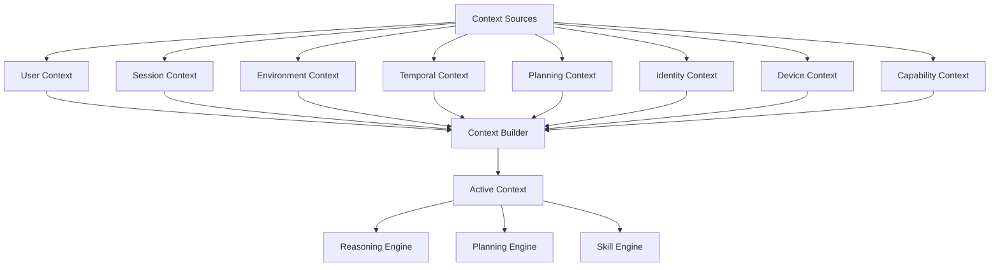
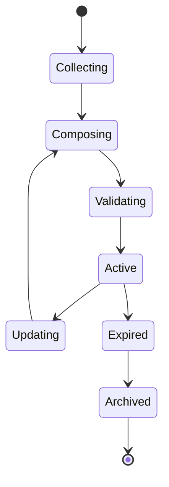
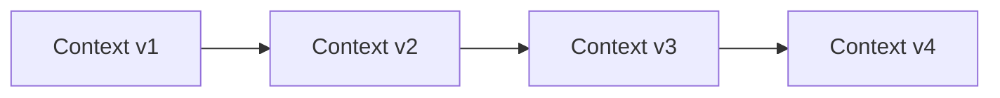
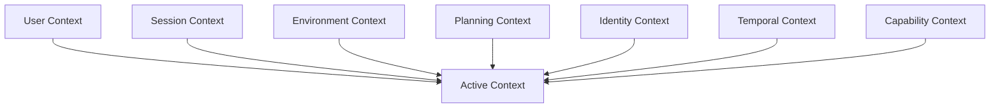
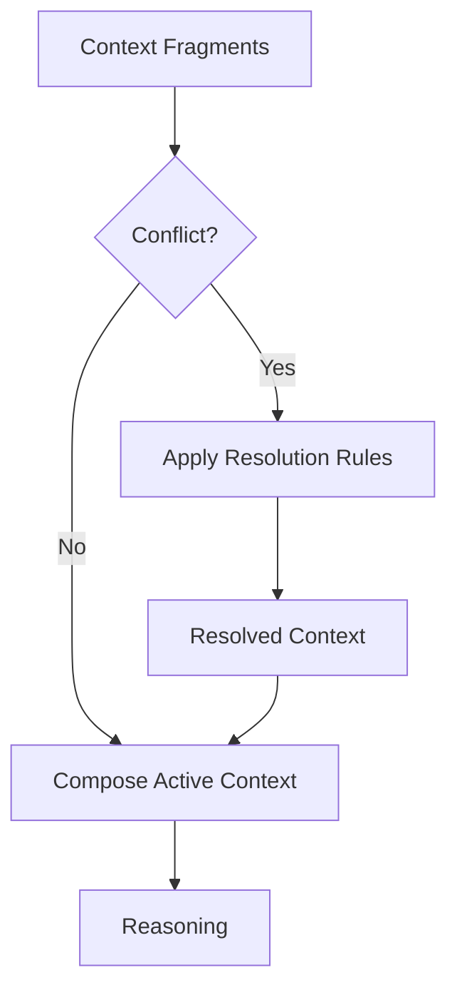
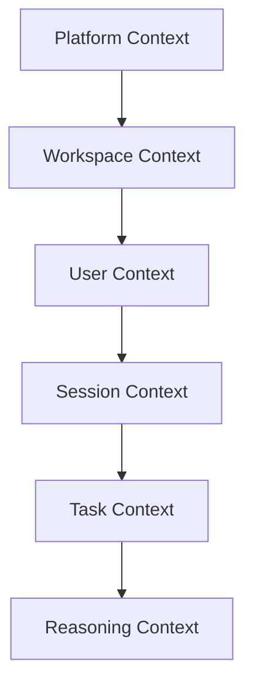
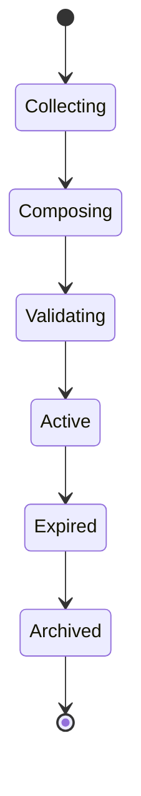

# Context Model

> **Status**
>
> Draft

---

# Abstract

The Context Model defines how O.R.I.O.N. represents, composes, evolves, and expires the information that is relevant at a specific moment in time.

Unlike Memory, which preserves historical experience, or Knowledge, which represents durable truths, Context is intentionally ephemeral. It exists solely to enable reasoning over the current situation and is continuously reconstructed as the environment, user interactions, and system state evolve.

This specification establishes the conceptual foundations of Context within the O.R.I.O.N. architecture, defining its principles, lifecycle, composition rules, identity, metadata, relationships with other cognitive models, and its role in enabling explainable, deterministic, and capability-oriented reasoning.

The goal of this document is to provide a technology-independent specification that guides every future implementation of the Context Engine while maintaining architectural consistency across providers, devices, execution environments, and AI models.

## Table of Contents

1. Purpose
2. Vision
3. Scope
4. Definitions
    4.1 Terminology Conventions
    4.2 Architectural Terms
    4.3 Specification Language
5. Design Goals
6. Non-Goals
7. Core Principles
8. Conceptual Model
9. Core Components
10. Context Lifecycle
11. Context Identity
12. Context Metadata
13. Context Composition
14. Context Resolution
15. Context Hierarchy and Scopes
16. State Management
17. Relationships
18. Engine Responsibilities
19. Design Constraints
20. Examples
21. Future Evolution
22. References

Document Classification

Normative Sections
Informative Sections
RFC Keywords
Reading Guide

# 1. Purpose

The purpose of the Context Model is to establish a unified conceptual framework for representing the information that is relevant to reasoning at a specific moment in time.

Within O.R.I.O.N., every intelligent decision depends on the ability to understand not only what is permanently true (Knowledge) or what has happened in the past (Memory), but also what is currently occurring across the user, the environment, the platform, and the execution state.

The Context Model provides this capability by defining a temporary, composable, and continuously evolving representation of the operational state of the system.

This specification is technology-independent and serves as the architectural contract for every future implementation of the Context Engine.

Its objectives are to:

- Establish a common language for Context across the platform.
- Define the lifecycle of contextual information.
- Specify how Context is composed from multiple sources.
- Describe the relationship between Context, Memory, and Knowledge.
- Provide deterministic rules for context resolution.
- Enable explainable reasoning across engines and skills.
- Preserve architectural consistency independently of providers or execution environments.

This document intentionally focuses on conceptual behavior rather than implementation details.

Implementation-specific concerns are delegated to the corresponding Engine Specifications.

# 2. Vision

O.R.I.O.N. is designed as a long-lived intelligent operating network capable of interacting with users, services, devices, and autonomous capabilities across heterogeneous environments.

To operate effectively, the platform must continuously answer a fundamental question:

> **"What is happening right now?"**

The Context Model exists to provide this answer.

Rather than representing permanent knowledge or historical experiences, Context captures the transient conditions under which reasoning occurs. It represents the current operational reality of the platform, combining information from the user, the environment, active workflows, system state, and external events into a unified cognitive representation.

This model enables every Engine, Skill, and planning component to reason from a shared understanding of the present moment.

As O.R.I.O.N. evolves toward multi-agent collaboration, distributed execution, and cross-device intelligence, Context becomes the common language that synchronizes decision making while preserving consistency, explainability, and deterministic behavior.

The long-term vision of the Context Model is to establish a technology-independent abstraction capable of representing the operational state of the platform regardless of implementation details, execution environments, providers, or artificial intelligence models.

By separating temporary contextual information from historical Memory and stable Knowledge, O.R.I.O.N. ensures that reasoning remains adaptive without compromising architectural integrity or long-term maintainability.

# 3. Scope

This specification defines the conceptual foundations of Context within the O.R.I.O.N. platform.

It establishes the principles, terminology, responsibilities, and behavioral rules that govern how contextual information is represented, composed, maintained, and consumed during system operation.

Specifically, this document defines:

- The conceptual definition of Context.
- The role of Context within the cognitive architecture.
- The lifecycle of contextual information.
- Context composition and resolution principles.
- Relationships between Context, Memory, and Knowledge.
- Context identity and metadata.
- Architectural constraints governing Context evolution.
- Responsibilities delegated to the Context Engine.

This specification intentionally avoids implementation-specific details, including storage mechanisms, serialization formats, synchronization protocols, provider integrations, or execution strategies.

Such concerns belong to implementation-level specifications and Engine documentation.

# 4. Definitions

The following definitions establish the terminology used throughout this specification.

| Term | Definition |
|------|------------|
| **Context** | The temporary representation of all information relevant to reasoning at a specific moment in time. |
| **Context Fragment** | An independent unit of contextual information that contributes to the construction of the Active Context. |
| **Active Context** | The complete contextual representation currently available to the reasoning process. |
| **Context Source** | Any component capable of providing information used to construct Context. |
| **Context Resolution** | The process of resolving conflicting or overlapping contextual information from multiple sources. |
| **Context Lifetime** | The period during which a Context remains valid for reasoning purposes. |
| **Context Identity** | The unique identity assigned to a specific Context instance. |
| **Context Version** | A logical revision representing the evolution of a Context over time. |
| **Context Snapshot** | An immutable representation of Context at a specific point in time. |
| **Reasoning Cycle** | A complete execution cycle during which a single immutable Context is consumed by the Reasoning Engine. |

# 5. Terminology Conventions

The following conventions are used throughout this specification to ensure consistency, readability, and unambiguous interpretation.

These conventions apply to all current and future O.R.I.O.N. specifications unless explicitly overridden.

| Convention | Meaning | Example |
|------------|---------|---------|
| **PascalCase** | Architectural concepts, engines, and major platform components. | `Context`, `Memory`, `Knowledge`, `Reasoning Engine` |
| *italic* | First introduction of a new conceptual term. | *Context Fragment* |
| `code` | Technical identifiers, interfaces, properties, contracts, or implementation examples. | `contextId`, `ContextBuilder`, `ContextSnapshot` |
| **UPPERCASE** | Reserved keywords, logical states, or platform constants. | `ACTIVE`, `EXPIRED`, `INVALID` |

---

## Concept Naming

Within O.R.I.O.N., conceptual entities are treated as architectural abstractions rather than implementation artifacts.

Consequently, capitalized terms always refer to architectural concepts.

Examples include:

- **Context**
- **Memory**
- **Knowledge**
- **Reasoning**
- **Capability**
- **Skill**
- **Engine**
- **Provider**
- **Adapter**

Lowercase forms refer to concrete instances of those concepts.

Examples:

- a context
- a memory record
- a knowledge source
- an engine instance

---

## Context Terminology

Unless otherwise specified, the following terminology is used consistently throughout the platform.

| Term | Description |
|------|-------------|
| **Context** | The architectural concept representing temporary operational information. |
| **context** | A concrete instance of Context. |
| **Active Context** | The immutable Context currently consumed by the Reasoning Engine. |
| **Context Fragment** | An independently produced portion of contextual information. |
| **Context Builder** | The component responsible for assembling Context Fragments into an Active Context. |
| **Context Source** | Any component capable of contributing information to Context construction. |
| **Context Snapshot** | A preserved immutable representation of a Context at a particular moment. |
| **Context Version** | A logical revision generated after Context evolution. |

---

## Engine Terminology

All architectural engines follow a consistent naming convention.

Examples include:

- Context Engine
- Memory Engine
- Planning Engine
- Identity Engine
- Skill Engine
- Voice Engine

The term **Engine** always refers to a capability owner within the platform architecture and never to a specific software process or executable.

---

## Specification Language

The keywords **MUST**, **MUST NOT**, **SHOULD**, **SHOULD NOT**, and **MAY** are to be interpreted as described in RFC 2119.

These keywords indicate the normative strength of architectural requirements within this specification.

Examples:

- A Context **MUST** have a unique identity.
- Context **MUST NOT** duplicate Knowledge.
- A Context Fragment **MAY** originate from an external Provider.
- A Context Builder **SHOULD** preserve deterministic composition whenever possible.

---

> **NOTE**
>
> Consistent terminology is considered part of the architectural contract.
> Future specifications SHOULD reuse these definitions whenever applicable instead of redefining equivalent concepts.

# 5. Design Goals

The Context Model is designed to provide a consistent, deterministic, and technology-independent representation of the information required for reasoning at any given moment.

The following goals guide every architectural and implementation decision related to Context within the O.R.I.O.N. platform.

## 5.1 DG-001 — Represent the Present

Context MUST represent the current operational reality of the platform rather than historical or permanent information.

Its primary purpose is to answer the question:

> **"What is relevant right now?"**

---

## 5.2 DG-002 — Enable Deterministic Reasoning

Given the same inputs, Context SHOULD produce the same logical representation.

Deterministic Context construction improves explainability, reproducibility, debugging, and testing across the platform.

---

## 5.3 DG-003 — Support Composability

Context MUST be composed from independent Context Fragments rather than constructed as a monolithic object.

This allows independent evolution of capabilities while minimizing coupling between engines.

---

## 5.4 DG-004 — Remain Technology Independent

The conceptual representation of Context MUST remain independent of:

- Programming languages
- Databases
- AI models
- Providers
- Communication protocols
- Execution environments

This specification defines behavior rather than implementation.

---

## 5.5 DG-005 — Enable Explainability

Every reasoning process SHOULD be traceable to the Context that produced it.

The platform must be capable of explaining which contextual information influenced a decision.

---

## 5.6 DG-006 — Minimize Information Duplication

Context SHOULD reference existing information whenever possible.

Historical information belongs to Memory.

Permanent information belongs to Knowledge.

Context only assembles what is currently relevant.

---

## 5.7 DG-007 — Support Continuous Evolution

Context MUST evolve as new information becomes available.

Instead of modifying previous Context instances, the platform generates new versions representing the updated operational state.

---

## 5.8 DG-008 — Scale Across the Platform

The Context Model MUST support:

- Multiple users
- Multiple sessions
- Multiple devices
- Multiple agents
- Distributed execution
- Future platform capabilities

without requiring changes to its conceptual foundations.

# 6. Non-Goals

The Context Model intentionally excludes responsibilities that belong to other architectural concepts or platform components.

The following responsibilities are outside the scope of Context.

---

## 6.1 NG-001 — Historical Storage

Context is not responsible for preserving historical information.

Historical experiences belong exclusively to the Memory Model.

---

## 6.2 NG-002 — Knowledge Representation

Context does not define permanent truths, facts, or domain expertise.

Such information belongs to the Knowledge Model.

---

## 6.3 NG-003 — Business Logic

Context does not execute business rules.

Business behavior is implemented by Skills and the corresponding Engines.

---

## 6.4 NG-004 — Decision Making

Context provides information for reasoning but does not make decisions.

Decision making belongs to the Reasoning Engine and Planning Engine.

---

## 6.5 NG-005 — External Integration

Context does not communicate directly with external systems.

External communication is delegated to Providers and Adapters.

---

## 6.6 NG-006 — Data Persistence

This specification does not define how Context is stored.

Persistence mechanisms are implementation-specific.

---

## 6.7 NG-007 — Synchronization Protocols

Synchronization between devices, agents, or distributed nodes is outside the scope of this specification.

Such concerns belong to distributed platform architecture.

---

## 6.8 NG-008 — Artificial Intelligence Models

The Context Model is independent of any specific artificial intelligence technology.

Whether reasoning is performed by rule engines, LLMs, symbolic systems, or future AI paradigms has no impact on the conceptual definition of Context.

---

## 6.9 NG-009 — User Interface Behavior

The Context Model does not define user interface behavior or interaction patterns.

Presentation concerns remain outside the conceptual architecture.

# 7. Core Principles

The following principles define the fundamental architectural rules governing Context within O.R.I.O.N.

Every implementation of the Context Model MUST comply with these principles regardless of technology, provider, or execution environment.

Violation of these principles constitutes a deviation from the O.R.I.O.N. architecture.

---

## 7.1 CP-001 — Context Is Temporary

Context exists only while it remains relevant to the current reasoning process.

Unlike Memory and Knowledge, Context is intentionally ephemeral and MUST expire once its operational purpose has been fulfilled.

Temporary information MUST NOT be treated as permanent state.

---

## 7.2 CP-002 — Context Represents the Present

Context represents the current operational reality of the platform.

It answers questions such as:

- What is happening now?
- Who is interacting with the platform?
- What capabilities are currently available?
- Which constraints exist at this moment?

Historical events belong to Memory.

Permanent truths belong to Knowledge.

---

## 7.3 CP-003 — Context Is Composable

Context SHALL be constructed from multiple independent Context Fragments.

Each fragment contributes a specific perspective of the current operational state.

Examples include:

- User Context
- Session Context
- Environment Context
- Planning Context
- Device Context
- Temporal Context

Composable Context enables independent evolution of platform capabilities while minimizing architectural coupling.

---

## 7.4 CP-004 — Context Does Not Own Information

Context is not the owner of the information it represents.

Instead, it references information originating from authoritative sources.

For example:

- historical information originates from Memory
- permanent facts originate from Knowledge
- device state originates from Providers
- identity information originates from the Identity Engine

This principle minimizes duplication and preserves consistency across the platform.

---

## 7.5 CP-005 — Context Is Immutable During Reasoning

Once a reasoning cycle begins, the Active Context becomes immutable.

No component may modify the Context currently being consumed by the Reasoning Engine.

Changes occurring during execution SHALL generate a new Context Version.

This guarantees deterministic reasoning and reproducibility.

---

## 7.6 CP-006 — Context Evolves Through Versioning

Context is never modified in place.

Each meaningful change results in the creation of a new logical Context Version.

Previous versions MAY remain available for debugging, auditing, or explainability purposes.

---

## 7.7 CP-007 — Context Is Explainable

Every reasoning outcome SHOULD be traceable to the Context that produced it.

The platform SHOULD be capable of identifying:

- which Context Fragments participated,
- which information sources contributed,
- which assumptions were active,
- which constraints influenced the decision.

Explainability is a first-class architectural requirement.

---

## 7.8 CP-008 — Context Is Reconstructable

Context SHALL always be reconstructable from its authoritative sources.

Loss of an Active Context MUST NOT imply loss of information.

This principle enables resilience, recovery, replay, and distributed execution.

---

## 7.9 CP-009 — Context Is Capability-Oriented

Context exists to support platform capabilities rather than implementation components.

Every Engine and Skill consumes Context through architectural contracts instead of direct dependencies.

This preserves loose coupling across the platform.

---

## 7.10 CP-010 — Context Is Technology Independent

The conceptual definition of Context MUST remain independent of implementation technologies.

No programming language, storage mechanism, AI model, framework, provider, or execution environment may alter the conceptual behavior defined by this specification.

Technology choices belong to implementation layers rather than conceptual architecture.

---

> **IMPORTANT**
>
> These principles define the architectural contract of the Context Model.
> Future Engine Specifications MUST refine these principles but MUST NOT contradict them.

# 8. Conceptual Model

The Context Model represents the temporary cognitive state of the O.R.I.O.N. platform.

Rather than existing as a monolithic object, Context is composed of multiple independent Context Fragments that collectively describe the current operational reality.

Each fragment represents a distinct perspective of the system, allowing Context to evolve incrementally while preserving loose coupling between capabilities.

The resulting Active Context provides a unified representation that can be safely consumed by reasoning, planning, and execution engines.

At no point does Context become the authoritative owner of information.

Instead, it acts as a temporary composition layer that references information maintained by their respective architectural owners.

---

## Conceptual Architecture

---

## Conceptual Responsibilities

The Context Model is responsible for:

- Representing the current operational situation.
- Aggregating contextual information from multiple sources.
- Providing a unified view of the present.
- Supporting deterministic reasoning.
- Enabling explainable decision making.
- Maintaining temporary contextual state.

The Context Model is **not** responsible for:

- Persisting historical information.
- Owning business entities.
- Executing workflows.
- Applying business rules.
- Communicating with external systems.

---

## Context Composition Philosophy

Context is intentionally designed as a composition layer rather than a storage layer.

Every Context Fragment contributes information from a specific domain without transferring ownership of that information.

For example:

- Identity information remains owned by the Identity Engine.
- Historical information remains owned by the Memory Engine.
- Domain knowledge remains owned by the Knowledge Engine.
- Device information remains owned by infrastructure providers.

The Context Builder assembles references to these sources into a coherent operational representation.

This design minimizes duplication, reduces synchronization complexity, and preserves clear ownership boundaries across the platform.

---

## Active Context

The result of Context composition is called the **Active Context**.

The Active Context represents the complete cognitive state available to the platform during a single reasoning cycle.

An Active Context:

- has a unique identity,
- has a logical version,
- is immutable,
- contains references to authoritative sources,
- expires when no longer relevant.

Only one Active Context is consumed during a single reasoning cycle.

If the operational reality changes while reasoning is in progress, a new Active Context SHALL be generated for the next reasoning cycle.

---

> **NOTE**
>
> The Context Model intentionally separates the construction of Context from its consumption.
>
> Context Builder creates Context.
>
> Engines consume Context.
>
> This separation preserves loose coupling and allows independent evolution of both responsibilities.

# 9. Core Components

The Context Model is composed of a small set of architectural components that collaborate to construct, maintain, and expose the Active Context.

These components are conceptual and do not prescribe implementation details.

---

## Context Source

A Context Source is any component capable of contributing contextual information.

Examples include:

- User interactions
- Memory Engine
- Knowledge Engine
- Identity Engine
- Device Providers
- External Events
- Calendar Providers
- Running Skills
- Platform Infrastructure

Each source owns the information it contributes.

---

## Context Fragment

A Context Fragment is the smallest composable unit of contextual information.

Each fragment represents a specific domain of the current operational state.

Examples:

- User Context
- Session Context
- Device Context
- Planning Context
- Environment Context

Fragments evolve independently and are composed dynamically.

---

## Context Builder

The Context Builder is responsible for assembling Context Fragments into a coherent Active Context.

Its responsibilities include:

- collecting fragments,
- validating consistency,
- resolving conflicts,
- assigning metadata,
- generating Context Identity,
- creating Context Versions.

The Builder never modifies authoritative information.

---

## Active Context

The Active Context is the final product generated by the Context Builder.

It represents the complete operational situation consumed by platform engines.

Only Active Context participates directly in reasoning.

---

## Context Version

Each significant evolution of the operational state generates a new Context Version.

Versions allow:

- deterministic reasoning,
- replay,
- explainability,
- auditing,
- debugging.

---

## Context Snapshot

A Context Snapshot is an immutable capture of an Active Context at a particular moment.

Snapshots MAY be preserved for:

- diagnostics,
- replay,
- testing,
- auditing,
- explainability.

Snapshots are optional implementation artifacts and do not alter the conceptual model.

---

## Context Metadata

Every Active Context carries metadata describing its identity and operational characteristics.

Metadata is defined in Section 12.

---

> **IMPORTANT**
>
> These components define the minimum conceptual structure required by every implementation of the Context Model.
>
> Future implementations MAY introduce additional internal components provided they preserve the architectural principles defined by this specification.

# 10. Context Lifecycle

Context is inherently dynamic.

Unlike Knowledge, which evolves slowly, or Memory, which accumulates over time, Context continuously changes as the operational state of the platform evolves.

This specification defines the conceptual lifecycle of Context independently of implementation details.

---

## Lifecycle Overview

Every Context progresses through a well-defined lifecycle.

The lifecycle ensures that Context remains consistent, explainable, and deterministic throughout its existence.

---

## Collecting

During this phase, Context Sources provide the information required to construct the current operational state.

Examples include:

- User interactions
- Active sessions
- Device state
- Running Skills
- Memory references
- Knowledge references
- Environmental conditions

At this stage, Context does not yet exist as a unified representation.

---

## Composing

The collected Context Fragments are assembled into a coherent representation.

Composition is responsible for:

- aggregating fragments,
- preserving ownership boundaries,
- maintaining consistency,
- preparing the Active Context.

Composition MUST NOT modify the authoritative information contributed by Context Sources.

---

## Validating

Before becoming active, the composed Context SHALL be validated.

Validation ensures that:

- required fragments exist,
- metadata is complete,
- conflicting information has been resolved,
- Context satisfies architectural constraints.

If validation fails, the Context MUST NOT become active.

---

## Active

An Active Context represents the current operational state of the platform.

During this phase:

- Context is immutable.
- Engines consume Context.
- Reasoning executes.
- Skills access contextual information.

Only validated Context may enter this state.

---

## Updating

Operational reality continuously evolves.

Whenever relevant information changes, the current Context is no longer considered fully representative.

Instead of modifying the existing Context, the platform generates a new Context Version that reflects the updated state.

This preserves deterministic reasoning while allowing continuous adaptation.

---

## Expired

A Context becomes expired when it is no longer relevant.

Expiration MAY occur due to:

- completion of a reasoning cycle,
- session termination,
- timeout,
- environmental changes,
- explicit invalidation.

Expired Context MUST NOT be reused for future reasoning.

---

## Archived

Implementations MAY preserve expired Context instances for purposes such as:

- auditing,
- diagnostics,
- replay,
- explainability,
- testing.

Archiving is optional and implementation-dependent.

The conceptual model only requires that archived Context remains immutable.

# 11. Context Identity

Every Active Context SHALL possess a unique identity.

Context Identity enables traceability, reproducibility, explainability, and version management across the platform.

Identity is assigned when a Context is successfully composed and validated.

---

## Identity Requirements

Every Context Identity SHALL satisfy the following requirements.

### Uniqueness

Each Context instance MUST be uniquely identifiable.

No two Active Contexts may share the same identity.

---

### Immutability

Once assigned, a Context Identity SHALL never change.

Any evolution of Context results in a new Context Version rather than modification of the existing identity.

---

### Traceability

Context Identity enables platform components to determine:

- which Context participated in reasoning,
- which decisions originated from that Context,
- which fragments composed it,
- which version was active during execution.

---

### Independence

Context Identity is an architectural concept.

Its implementation MAY use:

- UUIDs,
- ULIDs,
- hashes,
- internal identifiers,
- any equivalent mechanism.

The conceptual model imposes uniqueness requirements but does not prescribe a specific implementation strategy.

---

## Context Version

Identity and Version are complementary concepts.

- Identity distinguishes one Context instance from another.
- Version represents the evolution of Context over time.

Every new logical revision SHALL generate a new Context Version while preserving complete traceability.

---

## Context Lineage

Successive Context Versions form a logical lineage.

This lineage enables replay, debugging, auditing, and explainability without compromising immutability.

# 12. Context Metadata

Every Active Context SHALL include metadata describing its operational characteristics.

Metadata provides the information required to identify, validate, trace, version, and manage Context throughout its lifecycle without affecting the contextual information itself.

Metadata is considered part of the architectural contract of Context.

---

## Purpose

Context Metadata exists to support:

- Context identification
- Lifecycle management
- Version tracking
- Explainability
- Auditing
- Diagnostics
- Distributed execution
- Future synchronization mechanisms

Metadata MUST describe Context.

Metadata MUST NOT become Context itself.

---

## Metadata Principles

Context Metadata follows the principles below.

### MD-001 — Separation of Concerns

Metadata SHALL describe Context without containing business information.

Business information belongs to Context Fragments.

---

### MD-002 — Immutability

Metadata associated with an Active Context SHALL remain immutable throughout the reasoning cycle.

---

### MD-003 — Traceability

Metadata SHALL provide sufficient information to identify the origin and evolution of Context.

---

### MD-004 — Technology Independence

This specification defines metadata conceptually.

Implementations MAY represent metadata using any suitable format.

---

## Conceptual Metadata Model

Every Active Context SHOULD conceptually expose metadata equivalent to the following.

| Property | Description |
|----------|-------------|
| Context Identity | Unique identifier of the Context instance. |
| Context Version | Logical version of the Context. |
| Created At | Timestamp indicating when Context was created. |
| Expires At | Timestamp indicating when Context becomes invalid. |
| Lifecycle State | Current lifecycle stage of Context. |
| Source Count | Number of Context Sources contributing to the Context. |
| Fragment Count | Number of Context Fragments composing the Context. |
| Parent Context | Previous Context from which this Context evolved, if applicable. |

The conceptual model intentionally avoids prescribing concrete property names or serialization formats.

---

## Context State

Every Context SHALL exist in one conceptual lifecycle state.

Possible states include:

| State | Description |
|-------|-------------|
| Collecting | Context is being assembled. |
| Composing | Context Fragments are being merged. |
| Validating | Context is undergoing validation. |
| Active | Context is available for reasoning. |
| Expired | Context is no longer valid. |
| Archived | Context has been preserved for future reference. |

Implementations MAY introduce additional internal states provided they preserve the conceptual lifecycle defined by this specification.

---

## Metadata Evolution

Metadata evolves only when a new Context Version is created.

Once a Context becomes Active:

- Identity SHALL remain unchanged.
- Version SHALL remain unchanged.
- Creation timestamp SHALL remain unchanged.
- Fragment composition SHALL remain immutable.

Any significant operational change SHALL produce a new Context Version with its own metadata.

---

## Architectural Notes

Metadata exists to describe Context rather than influence reasoning.

Reasoning engines consume contextual information.

Platform infrastructure consumes metadata.

Maintaining this separation preserves conceptual clarity and minimizes coupling between cognitive behavior and operational concerns.

---

> **NOTE**
>
> Metadata is intentionally separated from Context Fragments to ensure that operational characteristics do not become part of the cognitive representation used for reasoning.

# 13. Context Composition

Context does not exist as a predefined object.

Instead, it is dynamically composed from multiple Context Fragments representing different aspects of the current operational reality.

Composition is the process through which these independent fragments become a unified Active Context.

---

## Composition Principles

Context composition follows the principles below.

### CC-001 — Fragment Independence

Each Context Fragment SHALL evolve independently.

No fragment may assume ownership of another fragment.

---

### CC-002 — Single Responsibility

Each fragment SHALL represent one conceptual concern.

Examples include:

- User Context
- Session Context
- Environment Context
- Planning Context
- Device Context

---

### CC-003 — Unified Representation

Although fragments remain conceptually independent, the resulting Active Context SHALL provide a coherent view of the current operational state.

---

### CC-004 — Reference over Duplication

Whenever possible, Context SHALL reference authoritative information instead of duplicating it.

This minimizes synchronization complexity while preserving consistency.

---

## Conceptual Composition

The conceptual composition of Context can be represented as follows.

---

## Fragment Ownership

Each fragment remains owned by its originating architectural component.

| Context Fragment | Architectural Owner |
|------------------|---------------------|
| User Context | Identity Engine |
| Session Context | Context Engine |
| Planning Context | Planning Engine |
| Memory References | Memory Engine |
| Knowledge References | Knowledge Engine |
| Capability Context | Skill Engine |
| Device Context | Infrastructure Providers |
| Temporal Context | Platform Infrastructure |

Ownership SHALL never be transferred during Context composition.

---

## Composition Constraints

The following constraints apply.

- Context SHALL remain internally consistent.
- Context SHALL remain deterministic.
- Context SHALL preserve ownership boundaries.
- Context SHALL avoid unnecessary duplication.
- Context SHALL remain reconstructable.

---

## Composition Outcome

The output of Context composition is a single immutable Active Context representing the complete operational state required for one reasoning cycle.

This Active Context becomes the only contextual representation consumed by platform engines until a new Context Version is generated.

---

> **IMPORTANT**
>
> Context composition defines *what* becomes part of Context.
>
> The algorithm responsible for performing this composition belongs to the Context Engine Specification and is intentionally outside the scope of this document.

# 14. Context Resolution

Context is composed from multiple independent Context Sources that may provide overlapping, complementary, or conflicting information.

The purpose of Context Resolution is to establish a deterministic conceptual framework for selecting, reconciling, or rejecting contextual information while preserving architectural consistency.

This specification defines the conceptual principles governing Context Resolution independently of any implementation strategy.

---

## Resolution Objectives

Context Resolution exists to ensure that the resulting Active Context is:

- Consistent
- Deterministic
- Explainable
- Reconstructable
- Free of unresolved conflicts

Resolution SHALL occur before a Context becomes Active.

---

## Resolution Principles

### 14.1 CR-001 — Deterministic Resolution

Given the same Context Fragments and the same Resolution Rules, the resulting Active Context SHALL always be identical.

Determinism is essential for reproducibility, debugging, auditing, and explainability.

---

### 14.2 CR-002 — Preserve Authoritative Sources

Whenever multiple Context Sources provide equivalent information, preference SHALL be given to the authoritative source.

Context MUST NOT redefine authoritative information.

---

### 14.3 CR-003 — Explicit User Intent Prevails

When a verified user instruction conflicts with inferred contextual information, explicit user intent SHALL take precedence unless doing so violates platform constraints or security policies.

---

### 14.4 CR-004 — Resolve Before Reasoning

Reasoning SHALL only consume a fully resolved Active Context.

Unresolved conflicts MUST NOT propagate into the reasoning process.

---

### 14.5 CR-005 — Explainable Resolution

Every resolved conflict SHOULD remain explainable.

Implementations SHOULD preserve sufficient information to describe:

- the conflicting sources,
- the applied resolution rule,
- the resulting decision.

---

## Resolution Categories

Context conflicts generally fall into one of the following categories.

| Category | Description |
|----------|-------------|
| Complementary | Multiple fragments contribute different information without conflict. |
| Redundant | Multiple fragments provide equivalent information. |
| Conflicting | Fragments disagree on the same contextual fact. |
| Incomplete | Required contextual information is missing. |
| Ambiguous | Multiple valid interpretations exist without sufficient evidence. |

Each category MAY require a different resolution strategy.

---

## Conceptual Resolution Flow

---

## Resolution Priority

When multiple Context Sources provide conflicting information, the conceptual priority SHOULD follow the order below.

| Priority | Source |
|----------|--------|
| 1 | Explicit User Input |
| 2 | Platform Policies |
| 3 | Verified Context Sources |
| 4 | Identity Information |
| 5 | Memory References |
| 6 | Knowledge References |
| 7 | Default Values |

This priority defines conceptual precedence only.

Implementation-specific scoring mechanisms are outside the scope of this specification.

---

## Unresolvable Conflicts

Some contextual conflicts cannot be resolved automatically.

Examples include:

- contradictory user instructions,
- insufficient contextual information,
- incompatible platform constraints.

When automatic resolution is impossible, the platform SHOULD:

- request additional information,
- postpone reasoning,
- escalate to higher-level decision mechanisms.

The chosen strategy is implementation-dependent.

---

> **IMPORTANT**
>
> Context Resolution determines which information becomes part of the Active Context.
>
> It does not perform reasoning, planning, or business decision making.

# 15. Context Hierarchy and Scopes

Context exists at multiple conceptual scopes throughout the platform.

Each scope represents a different level of operational relevance and determines the visibility and lifetime of contextual information.

Higher scopes provide broader contextual information, while lower scopes specialize that information for a specific activity.

---

## Scope Hierarchy

The conceptual hierarchy of Context Scopes is illustrated below.

Each lower scope inherits relevant information from its parent while introducing additional contextual specialization.

---

## Platform Context

The Platform Context contains information that is globally relevant across the entire O.R.I.O.N. platform.

Examples include:

- platform configuration,
- global capabilities,
- deployment characteristics,
- operational policies.

---

## Workspace Context

A Workspace Context represents contextual information shared within a logical working environment.

Examples include:

- active projects,
- shared objectives,
- collaborative sessions,
- organizational constraints.

---

## User Context

User Context contains contextual information associated with a particular user.

Examples include:

- preferences,
- permissions,
- active profile,
- personalization settings.

---

## Session Context

Session Context represents information specific to an active interaction.

Examples include:

- conversation history,
- active goals,
- temporary variables,
- ongoing workflows.

Session Context expires when the session ends.

---

## Task Context

Task Context contains information relevant to the execution of a particular task.

It exists only while the task remains active.

---

## Reasoning Context

Reasoning Context is the smallest operational scope.

It represents the immutable Active Context consumed during a single reasoning cycle.

Every reasoning cycle SHALL consume exactly one Reasoning Context.

---

## Scope Inheritance

Context flows from broader scopes toward narrower scopes.

Lower scopes MAY specialize inherited information but MUST NOT modify information owned by higher scopes.

This preserves consistency while enabling contextual specialization.

---

## Scope Isolation

Independent scopes SHALL remain logically isolated.

Changes occurring in one active task MUST NOT implicitly modify unrelated contexts unless explicitly propagated through architectural mechanisms.

This principle enables concurrent reasoning, parallel execution, and future multi-agent collaboration.

---

> **NOTE**
>
> Context Scopes define visibility and lifetime.
>
> They do not define ownership of contextual information, which remains governed by the Context Composition principles.

# 16. State Management

Context continuously evolves as the operational state of the platform changes.

The purpose of State Management is to define how Context transitions between valid operational states while preserving consistency, determinism, and explainability.

This specification intentionally describes state management conceptually rather than operationally.

---

## Objectives

State Management exists to ensure that:

- Context always represents the current operational reality.
- State transitions remain deterministic.
- Active Context remains immutable during reasoning.
- Context evolution is fully traceable.
- Invalid contextual states cannot propagate through the platform.

---

## State Principles

### 16.1 SM-001 — Controlled Evolution

Context SHALL evolve only through valid state transitions.

Arbitrary or implicit state modifications are prohibited.

---

### 16.2 SM-002 — Immutable Active State

Once a Context enters the Active state, its contextual information SHALL remain immutable until the reasoning cycle completes.

Subsequent operational changes SHALL generate a new Context Version rather than modifying the existing one.

---

### 16.3 SM-003 — Explicit Transitions

Every Context state transition SHALL be explicit.

Implicit state mutations reduce explainability and MUST be avoided.

---

### 16.4 SM-004 — Consistent Lifecycle

State transitions SHALL preserve the lifecycle defined in Section 10.

No implementation may bypass mandatory lifecycle stages without preserving their conceptual meaning.

---

## Conceptual State Machine

---

## Invalid State Transitions

The following conceptual transitions are considered invalid.

| Invalid Transition | Reason |
|--------------------|--------|
| Active → Collecting | Active Context cannot become mutable again. |
| Archived → Active | Archived Context represents historical state only. |
| Expired → Active | Expired Context is no longer operationally valid. |
| Active → Composing | Active Context cannot be recomposed in place. |

Implementations MUST prevent logically invalid transitions.

---

## State Consistency

At any point in time:

- every Context SHALL occupy exactly one lifecycle state,
- lifecycle states SHALL be mutually exclusive,
- state transitions SHALL preserve Context Identity,
- Context Version SHALL change only when a new Context is generated.

---

> **IMPORTANT**
>
> State transitions describe the evolution of Context itself.
>
> They do not describe workflow execution, business processes, or Skill behavior.

# 17. Relationships

The Context Model does not exist in isolation.

Its purpose is to integrate the temporary operational state of the platform while preserving clear ownership boundaries with the remaining conceptual models and architectural components.

This section defines the conceptual relationships between Context and the rest of the O.R.I.O.N. architecture.

---

## Relationship with Memory

Memory preserves historical experience.

Context references historical information only when it is relevant to the current operational situation.

Memory answers:

> **"What happened?"**

Context answers:

> **"What matters now?"**

Historical ownership always remains within the Memory Model.

---

## Relationship with Knowledge

Knowledge represents durable truths that remain valid independently of any particular situation.

Context references Knowledge whenever permanent information is required during reasoning.

Knowledge answers:

> **"What is true?"**

Context answers:

> **"What is relevant right now?"**

Knowledge remains the authoritative source of permanent facts.

---

## Relationship with Reasoning

Reasoning consumes Context.

Reasoning never owns Context.

Every reasoning cycle SHALL operate over exactly one immutable Active Context.

The quality of reasoning depends directly on the quality of Context.

---

## Relationship with Planning

Planning uses Context to determine current objectives, constraints, priorities, and available capabilities.

Planning MAY produce new contextual information that contributes to subsequent Context Versions.

Planning does not directly modify Active Context.

---

## Relationship with Skills

Skills consume contextual information necessary to execute business capabilities.

Skills SHALL access Context exclusively through architectural contracts.

Skills MUST NOT construct or mutate Context.

---

## Relationship with Identity

Identity contributes information describing the current user, permissions, authentication state, and active profile.

Identity remains the authoritative owner of identity-related information.

Context references identity information without assuming ownership.

---

## Relationship with Providers

Providers expose information originating from external technologies.

Such information MAY contribute to Context through Context Sources.

Providers never become part of Context themselves.

---

## Relationship with Events

Platform Events MAY trigger the creation of a new Context Version.

Events represent changes.

Context represents the operational state resulting from those changes.

---

## Relationship Summary

| Architectural Component | Relationship |
|--------------------------|--------------|
| Memory | Provides historical references. |
| Knowledge | Provides permanent references. |
| Identity Engine | Provides identity information. |
| Planning Engine | Consumes Context for planning. |
| Reasoning Engine | Consumes Active Context. |
| Skill Engine | Uses Context to execute capabilities. |
| Providers | Supply contextual information. |
| Events | Trigger Context evolution. |

---

> **NOTE**
>
> Context serves as the cognitive integration layer of the platform.
>
> It coordinates information without becoming the owner of that information.

# 18. Engine Responsibilities

The Context Model defines the conceptual responsibilities associated with the management and consumption of Context throughout the O.R.I.O.N. platform.

This section establishes the architectural responsibilities of the engines interacting with Context while preserving clear ownership boundaries.

---

## Responsibility Principles

The following principles govern the interaction between engines and Context.

### ER-001 — Separation of Responsibilities

Each Engine SHALL interact with Context according to its architectural role.

No Engine SHALL assume responsibilities belonging to another Engine.

---

### ER-002 — Context Ownership

The Context Engine is the sole architectural owner responsible for constructing and maintaining Active Context.

Other Engines MAY contribute Context Fragments but SHALL NOT construct Active Context independently.

---

### ER-003 — Read-Only Consumption

Engines consuming Active Context SHALL treat it as immutable.

No Engine SHALL modify an Active Context during a reasoning cycle.

---

### ER-004 — Contract-Based Access

All interactions with Context SHALL occur through architectural contracts.

Direct dependencies between Engines and internal Context implementation details are prohibited.

---

## Context Engine

The Context Engine is responsible for:

- collecting Context Fragments,
- validating contextual consistency,
- composing Active Context,
- assigning Context Identity,
- generating Context Versions,
- managing Context lifecycle.

The Context Engine does not perform reasoning.

---

## Reasoning Engine

The Reasoning Engine is responsible for:

- consuming Active Context,
- evaluating contextual information,
- producing decisions,
- generating reasoning outcomes.

The Reasoning Engine SHALL NOT modify Context.

---

## Planning Engine

The Planning Engine is responsible for:

- analyzing contextual objectives,
- evaluating constraints,
- organizing future actions.

Planning MAY influence future Context Versions but SHALL NOT modify the currently active Context.

---

## Skill Engine

The Skill Engine consumes Context in order to execute platform capabilities.

Skills SHALL remain independent of Context construction mechanisms.

---

## Memory Engine

The Memory Engine provides historical references when requested by Context.

Memory remains the authoritative owner of historical information.

---

## Knowledge Engine

The Knowledge Engine provides permanent knowledge required during Context composition.

Knowledge ownership always remains external to Context.

---

## Identity Engine

The Identity Engine provides identity-related contextual information.

Identity data SHALL remain owned by the Identity Engine.

---

## Provider Layer

Providers contribute contextual information originating from external systems.

Providers SHALL never become direct participants in reasoning.

Instead, they expose information through Context Sources.

---

## Responsibility Matrix

| Component | Builds Context | Consumes Context | Owns Information |
|-----------|:--------------:|:----------------:|:----------------:|
| Context Engine | ✅ | ✅ | Context |
| Reasoning Engine | ❌ | ✅ | ❌ |
| Planning Engine | ❌ | ✅ | Planning State |
| Skill Engine | ❌ | ✅ | Skill State |
| Memory Engine | ❌ | Provides References | Memory |
| Knowledge Engine | ❌ | Provides References | Knowledge |
| Identity Engine | ❌ | Provides References | Identity |
| Providers | ❌ | Provide Data | External Systems |

---

> **IMPORTANT**
>
> Responsibility boundaries are fundamental to the Capability-Oriented Architecture adopted by O.R.I.O.N.
>
> Future Engine Specifications SHALL refine these responsibilities without violating their conceptual ownership.

# 19. Design Constraints

The following architectural constraints are mandatory for every implementation of the Context Model.

These constraints preserve conceptual integrity across the platform regardless of implementation technology.

---

## DC-001 — Context Must Remain Temporary

Context SHALL never become a permanent storage mechanism.

Persistent information belongs to Memory or Knowledge.

---

## DC-002 — Context Must Remain Immutable

Once Active, Context SHALL remain immutable until the reasoning cycle completes.

---

## DC-003 — Context Must Preserve Ownership

Context SHALL never assume ownership of information originating from other architectural components.

---

## DC-004 — Context Must Be Explainable

Every Context Version SHOULD remain traceable and explainable.

---

## DC-005 — Context Must Be Reconstructable

Given the same authoritative sources, the platform SHOULD be capable of reconstructing an equivalent Context.

---

## DC-006 — Context Must Be Technology Independent

The conceptual behavior defined by this specification SHALL remain independent of implementation technologies.

---

## DC-007 — Context Must Preserve Architectural Boundaries

Context SHALL respect the dependency direction established by ADR-0001 and ADR-0002.

No implementation may introduce architectural coupling that violates these decisions.

---

## DC-008 — Context Must Support Evolution

Future platform capabilities SHALL extend Context without requiring incompatible conceptual changes.

Backward-compatible evolution is strongly encouraged.

---

> **NOTE**
>
> Design Constraints represent non-negotiable architectural rules.
>
> Future implementations MAY extend the Context Model but MUST NOT violate these constraints.

# 20. Examples

The following examples illustrate how the Context Model may be conceptually applied within the O.R.I.O.N. platform.

These examples are informative rather than normative and do not prescribe implementation details.

---

## Example 1 — Starting a New Session

A user authenticates and begins a new interaction with O.R.I.O.N.

The platform gathers contextual information from multiple sources.

| Context Source | Context Fragment |
|----------------|------------------|
| Identity Engine | User identity |
| Session Manager | Session Context |
| Device Provider | Device Context |
| Platform Clock | Temporal Context |

These fragments are composed into a new Active Context before the first reasoning cycle begins.

---

## Example 2 — Continuing an Existing Task

A user requests:

> "Continue my previous architecture review."

The platform retrieves:

- current Session Context,
- active Workspace Context,
- recent Memory references,
- Planning Context.

Knowledge remains unchanged while Context adapts to the current interaction.

A new Active Context is generated and consumed by the Reasoning Engine.

---

## Example 3 — Environmental Change

During an active session, the user's device loses network connectivity.

The Device Context changes.

The current Active Context remains immutable until the reasoning cycle completes.

A subsequent reasoning cycle generates a new Context Version reflecting the updated connectivity state.

---

## Example 4 — Calendar Event

A scheduled meeting begins.

The Calendar Provider contributes a new Context Fragment.

The Context Engine composes a new Active Context containing:

- current meeting,
- participants,
- temporal information,
- active objectives.

Reasoning proceeds using the updated contextual state.

---

## Example 5 — Multi-Agent Collaboration

Future versions of O.R.I.O.N. may support multiple autonomous agents collaborating on the same objective.

Each agent maintains its own Active Context while sharing selected Context Fragments through controlled architectural mechanisms.

This preserves contextual isolation while enabling coordinated reasoning.

---

## Example 6 — Context Expiration

A user completes an interaction.

The Session Context expires.

The Active Context transitions to the Expired state.

Historical information remains available through Memory, while Context itself is discarded.

---

> **NOTE**
>
> These examples illustrate conceptual behavior only.
>
> Concrete implementation strategies belong to future Engine Specifications.

# 21. Future Evolution

The Context Model has been intentionally designed to support long-term evolution without requiring fundamental architectural changes.

Future platform capabilities may extend the model while preserving the principles established by this specification.

Potential areas of evolution include:

- Distributed Context across multiple execution environments.
- Shared Context for collaborative reasoning.
- Multi-agent contextual synchronization.
- Predictive Context generated from planning capabilities.
- Probabilistic Context incorporating confidence estimation.
- Context compression for long-running workflows.
- Context replay for diagnostics and explainability.
- Cross-device Context continuity.
- Federated Context across multiple O.R.I.O.N. instances.

Future extensions SHOULD preserve:

- composability,
- determinism,
- explainability,
- immutability,
- architectural ownership,
- technology independence.

Backward-compatible evolution is strongly encouraged.

Whenever a future capability requires changes that affect the conceptual foundations of Context, the corresponding Architectural Decision Record (ADR) SHALL be updated before implementation.

---

> **IMPORTANT**
>
> The Context Model is expected to evolve over time.
>
> However, its conceptual principles are intended to remain stable throughout the lifetime of the platform.

# 22. References

## Related Specifications

- ADR-0001 — Core Ownership and Dependency Direction
- ADR-0002 — Capability-Oriented Architecture
- ADR-0003 — Engine Communication Model
- ADR-0004 — Separation of Skills, Providers and Adapters
- ADR-0005 — Memory Architecture Principles

---

## Engineering Standards

- OES-0000 — Engineering Philosophy
- OES-0001 — Repository Structure
- OES-0002 — Engine Design
- OES-0003 — Skill Design
- OES-0004 — Contracts
- OES-0005 — Events
- OES-0006 — Provider Design
- OES-0007 — Adapter Design
- OES-0008 — Documentation Standards
- OES-0009 — Security Standards
- OES-0010 — Versioning Standards

---

## Related Concept Specifications

- CONCEPT-0001 — Memory Model
- CONCEPT-0002 — Knowledge Model

---

## Future Specifications

The following specifications are expected to expand the concepts introduced in this document.

- Context Engine Specification
- Reasoning Engine Specification
- Planning Engine Specification
- Identity Engine Specification
- Memory Engine Specification
- Knowledge Engine Specification

---

## External References

The following publications inspired architectural concepts adopted by O.R.I.O.N.

- RFC 2119 — Key words for use in RFCs to Indicate Requirement Levels
- Domain-Driven Design — Eric Evans
- Clean Architecture — Robert C. Martin
- Enterprise Integration Patterns — Gregor Hohpe & Bobby Woolf
- Building Evolutionary Architectures — Neal Ford et al.

---

## Document Status

This specification defines the conceptual architecture of Context within the O.R.I.O.N. platform.

Implementation details are intentionally deferred to future Engine Specifications.

Future revisions SHALL preserve compatibility with the architectural principles established herein unless explicitly superseded by an approved Architectural Decision Record (ADR).

## Appendix A — Concept Mapping

| Concept   | Owner            | Consumed By      |
| --------- | ---------------- | ---------------- |
| Context   | Context Engine   | Reasoning Engine |
| Memory    | Memory Engine    | Context Engine   |
| Knowledge | Knowledge Engine | Context Engine   |
| Identity  | Identity Engine  | Context Engine   |
